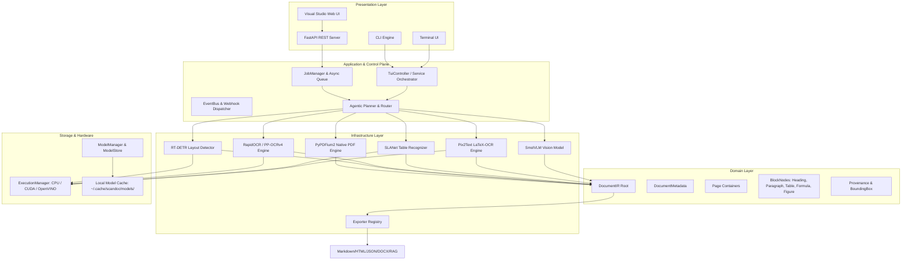

# scanDOC

**An Enterprise-Grade, Local-First Document Intelligence and Document Processing Engine.**

Turn PDFs, scanned documents, and images into structured, searchable, exportable **DocumentIR** — locally, deterministically, and with optional AI/ML acceleration.

[](https://www.python.org/)
[](LICENSE)
[](tests/)
[](pyproject.toml)
[](docs/ARCHITECTURE.md)
[](docs/MODEL_LIFECYCLE.md)

---

## Table of Contents

- [Overview](#overview)
- [Key Features](#key-features)
- [Architecture](#architecture)
- [DocumentIR](#documentir)
- [Processing Pipeline](#processing-pipeline)
- [Local-First Model Architecture](#local-first-model-architecture)
- [Model Inventory](#model-inventory)
- [CPU-Only Usage](#cpu-only-usage)
- [GPU & Hardware Acceleration](#gpu--hardware-acceleration)
- [Installation](#installation)
- [Quick Start](#quick-start)
- [CLI Documentation](#cli-documentation)
- [TUI — Interactive Terminal Interface](#tui--interactive-terminal-interface)
- [REST API Server](#rest-api-server)
- [Webhooks](#webhooks)
- [Provider Architecture](#provider-architecture)
- [Local vs Remote Execution](#local-vs-remote-execution)
- [Offline Mode](#offline-mode)
- [Model Storage & Caching](#model-storage--caching)
- [Exporters](#exporters)
- [Security & Compliance](#security--compliance)
- [Performance & Benchmarks](#performance--benchmarks)
- [Testing & Quality Assurance](#testing--quality-assurance)
- [Project Status](#project-status)
- [Roadmap](#roadmap)
- [Package Structure](#package-structure)
- [Development Setup](#development-setup)
- [Release & Packaging](#release--packaging)
- [Contributing](#contributing)
- [Troubleshooting](#troubleshooting)
- [Frequently Asked Questions (FAQ)](#frequently-asked-questions-faq)
- [Privacy & Data Ownership](#privacy--data-ownership)
- [License](#license)

---

## Overview

**scanDOC** is designed to solve a fundamental problem in modern data engineering and AI pipelines: extracting structured knowledge from unstructured documents (PDFs, scanned invoices, complex multi-column papers, technical manuals, tables, and mathematical formulas) **without forcing sensitive data into cloud APIs**.

Unlike heavy cloud-dependent services or basic wrapper scripts, scanDOC provides:

1. **Local-First & Offline-First Execution**: Complete document processing happens on your local workstation, air-gapped server, or private cloud cluster.
2. **Deterministic Processing**: Digital PDFs are parsed via fast native vector extraction in sub-50ms per page, reserving heavier ML models only for scanned pages or complex visual elements.
3. **Unified Intermediate Representation (`DocumentIR`)**: Decouples extraction from output. Every stage enriches a single, strongly-validated graph representation containing bounding boxes, reading order, and cell-level provenance.
4. **Modular Provider Architecture**: Hot-swap local ONNX models (RapidOCR, RT-DETR, SLANet, LaTeX-OCR), local VLMs (SmolVLM), Hugging Face models, or external remote APIs seamlessly.
5. **Multiple Enterprise Interfaces**: Operate via zero-dependency **CLI**, interactive **Claude-style TUI**, production **REST API (FastAPI)**, or embedded **Visual Studio Web UI**.

---

## Key Features

| Domain | Feature | Description |
|---|---|---|
| **Core Engine** | **`DocumentIR`** | Strongly-typed, Pydantic v2 graph representation of document structure. |
| | **Provenance** | Every block tracks extraction confidence, stage name, provider ID, and model checkpoint. |
| | **Normalized Bounding Boxes** | `[left, top, right, bottom]` spatial coordinates normalized to `[0.0, 1.0]` page bounds. |
| | **Adaptive Routing** | Dynamic planner switches between `fast` (native), `adaptive` (hybrid), `deep` (full ML), and `fallback`. |
| **Ingestion** | **Multi-Format** | Digital PDF, scanned PDF, PNG, JPEG, WEBP, BMP, and TIFF ingestion normalization. |
| | **Native PDF Parser** | Fast PyPDFium2 extraction of embedded text, glyph bounds, and vector layers. |
| | **Scanned Detection** | Automatic image-only / low character density page detection for OCR routing. |
| **Extraction** | **Multi-Engine OCR** | RapidOCR (PP-OCRv4), PyTesseract, and remote engine fallback options. |
| | **Layout Detection** | RT-DETR DocLayNet model recognizing headings, paragraphs, tables, figures, captions. |
| | **Reading Order** | Spatial reading order restoration algorithm preserving multi-column reading flow. |
| | **Table Recognition** | SLANet neural table structure recognizer decoding grid rows, columns, and merged cells. |
| | **Formula Recognition** | Pix2Text LaTeX-OCR vision engine converting mathematical equations to LaTeX notation. |
| | **VLM Understanding** | Multimodal Vision-Language Model integration (SmolVLM) for visual figure understanding. |
| **Exporters** | **Multi-Format Exporters** | Lossless exports to **Markdown**, **HTML**, **JSON**, **Text**, **DOCX**, **EPUB**, **PDF/A**, and **RAG JSON**. |
| **Interfaces** | **Command-Line (CLI)** | Full featured CLI with `convert`, `inspect`, `serve`, `benchmark`, `models`, `studio`, and `tui`. |
| | **Interactive TUI** | Claude Code-style terminal application powered by Rich Live alternate screen buffer. |
| | **REST API** | OpenAPI/Swagger compliant FastAPI server with sync and async background job queues. |
| | **Webhooks** | Signed HMAC-SHA256 event delivery with automatic exponential backoff retries. |
| **Runtime** | **Hardware Execution** | Hardware ExecutionManager selecting CPU, CUDA, OpenVINO, or TensorRT providers. |
| | **Model Lifecycle** | Autonomous ModelRegistry, ModelManager, checksum verification, and `SCANDOC_OFFLINE=1` cache. |

---

## Architecture

scanDOC is structured into five strictly separated architectural layers:



### Layer Responsibilities

1. **Presentation Layer**: Handles user interaction via CLI subcommands, Rich Live TUI screens, REST API routes, and browser-based Visual Studio tools.
2. **Application & Control Plane**: Manages asynchronous jobs, background worker threads, event publication (`EventBus`), signed webhook dispatching, and agentic route selection.
3. **Domain Layer (`DocumentIR`)**: The immutable source of truth. Contains normalized bounding boxes, page collections, block nodes, and provenance metadata.
4. **Infrastructure Layer**: Implements specialized providers for PDF extraction, layout detection, OCR, table grid decoding, LaTeX formula parsing, VLM analysis, and format exporting.
5. **Storage & Hardware Layer**: Orchestrates ONNX Runtime execution providers (CPU OpenMP, CUDA, OpenVINO), model weights downloading, SHA-256 verification, and offline caching.

---

## DocumentIR

### What is DocumentIR?

**`DocumentIR`** is the unified, lossless intermediate representation produced by scanDOC. Instead of parsing directly from PDF into Markdown or HTML (which loses spatial coordinates, fonts, confidence scores, and reading order), scanDOC first builds a complete graph of the document.

### Why DocumentIR Exists

- **Decouples Extraction from Output**: Parsers extract into `DocumentIR`. Exporters read from `DocumentIR`. Adding a new exporter (e.g. EPUB or RAG JSON) requires zero changes to OCR or layout logic.
- **Full Provenance & Bounding Boxes**: Every text span, table cell, and heading retains its exact page bounding box `[left, top, right, bottom]` normalized from `0.0` to `1.0`.
- **Lossless Validation**: Strongly typed with Pydantic v2. Block IDs are guaranteed to be globally unique across all pages, and reading order sequences are validated for spatial flow.

### DocumentIR JSON Example

```json
{
  "metadata": {
    "id": "doc_9f81a2b",
    "name": "financial_report.pdf",
    "mime_type": "application/pdf",
    "page_count": 1,
    "title": "Q4 Financial Overview",
    "author": "Corporate Finance",
    "created_at": "2026-01-15T08:30:00Z"
  },
  "pages": [
    {
      "page_index": 0,
      "width": 612.0,
      "height": 792.0,
      "unit": "POINTS",
      "rotation": 0,
      "blocks": [
        {
          "id": "blk_h1_0",
          "block_type": "heading",
          "text": "Executive Summary",
          "level": 1,
          "reading_order_index": 0,
          "bbox": {
            "left": 0.08,
            "top": 0.06,
            "right": 0.92,
            "bottom": 0.10,
            "page_index": 0,
            "coord_origin": "TOP_LEFT",
            "unit": "NORMALIZED",
            "is_normalized": true
          },
          "provenance": {
            "provider": "pypdfium2",
            "stage": "NATIVE_EXTRACTION",
            "confidence": 1.0
          }
        },
        {
          "id": "blk_tbl_1",
          "block_type": "table",
          "num_rows": 2,
          "num_cols": 2,
          "reading_order_index": 1,
          "caption": "Table 1: Revenue by Quarter",
          "bbox": {
            "left": 0.08,
            "top": 0.12,
            "right": 0.92,
            "bottom": 0.35,
            "page_index": 0,
            "coord_origin": "TOP_LEFT",
            "unit": "NORMALIZED",
            "is_normalized": true
          },
          "cells": [
            {
              "cell_id": "cell_0_0",
              "row_index": 0,
              "col_index": 0,
              "row_span": 1,
              "col_span": 1,
              "is_header": true,
              "text": "Quarter",
              "confidence": 0.98
            },
            {
              "cell_id": "cell_0_1",
              "row_index": 0,
              "col_index": 1,
              "row_span": 1,
              "col_span": 1,
              "is_header": true,
              "text": "Revenue ($M)",
              "confidence": 0.97
            }
          ],
          "provenance": {
            "provider": "slanet_table",
            "model": "slanet_table.onnx",
            "stage": "TABLE_RECOGNITION",
            "confidence": 0.96
          }
        }
      ]
    }
  ],
  "reading_order": {
    "sequence": ["blk_h1_0", "blk_tbl_1"]
  },
  "structure": {
    "heading_tree": {
      "blk_h1_0": ["blk_tbl_1"]
    },
    "body_block_ids": ["blk_h1_0", "blk_tbl_1"],
    "furniture_block_ids": []
  }
}
```

---

## Processing Pipeline

scanDOC executes a 12-stage document processing lifecycle:

```
┌─────────────────────────────────────────────────────────────────────────┐
│                       1. INPUT DISCOVERY & VALIDATION                   │
│   Accepts single PDF, multi-page image, or directory batch input.       │
└────────────────────────────────────┬────────────────────────────────────┘
                                     │
                                     ▼
┌─────────────────────────────────────────────────────────────────────────┐
│                      2. FORMAT DETECTION & NORMALIZATION                │
│   Detects MIME type, validates file integrity, extracts page sizes.     │
└────────────────────────────────────┬────────────────────────────────────┘
                                     │
                                     ▼
┌─────────────────────────────────────────────────────────────────────────┐
│                      3. NATIVE DIGITAL PDF EXTRACTION                   │
│   Extracts embedded vector text streams, glyph positions, font metrics. │
└────────────────────────────────────┬────────────────────────────────────┘
                                     │
                                     ▼
┌─────────────────────────────────────────────────────────────────────────┐
│                      4. SCANNED PAGE INSPECTION                         │
│   Analyzes character density & vector layer health. Classifies pages:   │
│   - DIGITAL: Fast native path (no ML required)                          │
│   - SCANNED: Triggers complete OCR pipeline                            │
│   - HYBRID: Native text + ML layout & image crops                       │
└────────────────────────────────────┬────────────────────────────────────┘
                                     │
                                     ▼
┌─────────────────────────────────────────────────────────────────────────┐
│                      5. OPTICAL CHARACTER RECOGNITION (OCR)             │
│   Executes RapidOCR (PP-OCRv4) / PyTesseract on scanned pages or crops.  │
└────────────────────────────────────┬────────────────────────────────────┘
                                     │
                                     ▼
┌─────────────────────────────────────────────────────────────────────────┐
│                      6. VISUAL LAYOUT ANALYSIS                          │
│   Runs RT-DETR DocLayNet model to detect spatial content blocks.       │
└────────────────────────────────────┬────────────────────────────────────┘
                                     │
                                     ▼
┌─────────────────────────────────────────────────────────────────────────┐
│                      7. READING ORDER RESTORATION                       │
│   Applies spatial Recursive XY-Cut algorithm to reconstruct reading flow│
└────────────────────────────────────┬────────────────────────────────────┘
                                     │
                                     ▼
┌─────────────────────────────────────────────────────────────────────────┐
│                      8. NEURAL TABLE RECOGNITION                        │
│   Runs SLANet table model to decode row/col grid and spanned cells.     │
└────────────────────────────────────┬────────────────────────────────────┘
                                     │
                                     ▼
┌─────────────────────────────────────────────────────────────────────────┐
│                      9. FORMULA RECOGNITION                             │
│   Executes Pix2Text LaTeX-OCR on detected math equation bounding boxes. │
└────────────────────────────────────┬────────────────────────────────────┘
                                     │
                                     ▼
┌─────────────────────────────────────────────────────────────────────────┐
│                      10. VLM MULTIMODAL ANALYSIS (OPTIONAL)             │
│   Passes complex charts/figures to SmolVLM for visual explanation.      │
└────────────────────────────────────┬────────────────────────────────────┘
                                     │
                                     ▼
┌─────────────────────────────────────────────────────────────────────────┐
│                      11. DOCUMENTIR ASSEMBLY & VALIDATION               │
│   Enforces unique block IDs, page bounds, and reading order sequence.   │
└────────────────────────────────────┬────────────────────────────────────┘
                                     │
                                     ▼
┌─────────────────────────────────────────────────────────────────────────┐
│                      12. EXPORT SERIALIZATION                           │
│   Transforms DocumentIR to Markdown, HTML, JSON, DOCX, or RAG Chunks.   │
└─────────────────────────────────────────────────────────────────────────┘
```

---

## Local-First Model Architecture

scanDOC is fundamentally **local-first** and **offline-first**:

1. **Lightweight Base Install**: Installing `pip install scandoc` installs the core engine without forcing hundreds of megabytes of ML model weights into your Python package directory.
2. **On-Demand Model Download**: Model weights are downloaded autonomously only when their corresponding pipeline feature (layout detection, table parsing, or formula recognition) is invoked.
3. **SHA-256 Checksum Verification**: Downloaded model binaries are verified against registered cryptographic SHA-256 hashes before loading into memory.
4. **Air-Gapped Operation**: Enforce strict offline execution with `SCANDOC_OFFLINE=1`. In offline mode, network calls are blocked, and scanDOC runs exclusively against local cached models.

---

## Model Inventory

Below is the complete inventory of machine learning models integrated into scanDOC:

| Task | Model ID | Architecture | Format | Size | Supported Devices | Supported Runtimes | Cache Filename |
|---|---|---|---|---|---|---|---|
| **OCR** | `rapidocr_onnx` | PP-OCRv4 Mobile | ONNX | ~10.8 MB | CPU, CUDA | ONNX Runtime | `ch_PP-OCRv4_rec_infer.onnx` |
| **Layout** | `rtdetr_doclaynet` | RT-DETR | ONNX | ~44.3 MB | CPU, CUDA, OpenVINO | ONNX Runtime | `rtdetr_doclaynet.onnx` |
| **Table** | `slanet_table` | SLANet | ONNX | ~18.5 MB | CPU, CUDA | ONNX Runtime | `slanet_table.onnx` |
| **Formula** | `pix2text_formula` | LaTeX-OCR | ONNX | ~18.9 MB | CPU, CUDA | ONNX Runtime | `latex_ocr.onnx` |
| **VLM** | `smolvlm_local` | SmolVLM (250M) | Safetensors | ~512 MB | CPU, CUDA | PyTorch / Transformers | `model.safetensors` |
| **Figure** | `basic_figure_analyzer` | Vision Primitive | ONNX | Local | CPU | Native | Local Path |
| **Formula** | `basic_formula_recognizer` | TeXify Primitive | ONNX | Local | CPU | Native | Local Path |

*Note: Model weight files are stored separately from Python package dependencies in `~/.cache/scandoc/models/`.*

---

## CPU-Only Usage

### Can scanDOC run without a GPU?

**Yes, absolutely.** scanDOC is engineered CPU-first. 

- **Native PDF Extraction**: Digital PDFs require 0 MB of VRAM and run at **sub-50ms per page** on standard CPU hardware.
- **ONNX Runtime OpenMP Acceleration**: OCR, layout analysis, table recognition, and formula recognition ONNX models utilize multi-threaded OpenMP CPU kernels.
- **No Mandatory PyTorch/CUDA**: You can process complete document workflows without NVIDIA drivers or PyTorch installed.

### Expected CPU Tradeoffs

- **Execution Time**: Neural layout and table recognition on CPU require ~150ms – 400ms per page, compared to ~20ms – 50ms on GPU.
- **Multimodal VLM**: `SmolVLM` (250M parameters) runs on CPU but requires 2–4 seconds per image prompt compared to sub-300ms on CUDA.
- **Conclusion**: GPU is an *optional acceleration provider*, not a system requirement.

---

## GPU & Hardware Acceleration

When an NVIDIA GPU or Intel OpenVINO accelerator is available, scanDOC automatically detects and activates hardware acceleration via `ExecutionManager`.

### Execution Provider Hierarchy

```python
# Hardware selection sequence:
1. CUDA (NVIDIA GPU via ONNX Runtime CUDA provider)
2. TensorRT (NVIDIA TensorRT engine runtime)
3. OpenVINO (Intel CPU/iGPU acceleration)
4. MPS (Apple Silicon Metal Performance Shaders)
5. CPU (High-performance multi-threaded OpenMP fallback)
```

To explicitly force a hardware target from CLI:

```bash
# Force CUDA GPU execution
scandoc convert input.pdf -o output.md --device cuda

# Force Intel OpenVINO execution
scandoc convert input.pdf -o output.md --device openvino

# Force CPU execution
scandoc convert input.pdf -o output.md --device cpu
```

---

## Installation

### Core Package Installation

```bash
pip install scandoc
```

### Installation Extras

Choose only the extras required for your environment:

```bash
# Native PDF Extraction (PyPDFium2)
pip install "scandoc[pdf]"

# Optical Character Recognition (RapidOCR + PyTesseract)
pip install "scandoc[ocr]"

# Neural Layout Analysis (RT-DETR)
pip install "scandoc[layout]"

# Table Structure Recognition (SLANet)
pip install "scandoc[table]"

# Formula Recognition (LaTeX-OCR)
pip install "scandoc[formula]"

# Multimodal VLM (SmolVLM / Transformers)
pip install "scandoc[vlm]"

# FastAPI REST API Server
pip install "scandoc[server]"

# Comparative Benchmarking vs Docling
pip install "scandoc[benchmark]"

# NVIDIA CUDA GPU Acceleration
pip install "scandoc[gpu]"

# Hugging Face Model Integration
pip install "scandoc[huggingface]"

# Interactive Rich Terminal UI (TUI)
pip install "scandoc[tui]"

# Full Installation (All Features & Dependencies)
pip install "scandoc[all]"
```

---

## Quick Start

### 1. Check Installation & Version

```bash
scandoc --version
```

### 2. Inspect a PDF Document

```bash
scandoc inspect sample.pdf --json
```

### 3. Convert a PDF to Markdown

```bash
scandoc convert sample.pdf -o output.md
```

### 4. Convert a Folder of Documents in Parallel

```bash
scandoc convert ./input_docs/ -d ./output_markdown/ -f markdown -w 8
```

### 5. Launch the Interactive Terminal UI (TUI)

```bash
scandoc tui
```

---

## CLI Documentation

### Command Summary

| Subcommand | Description |
|---|---|
| `scandoc convert` | Convert documents to structured outputs (Markdown, HTML, JSON, Text, DOCX). |
| `scandoc inspect` | Inspect document characteristics, page counts, native text layer, and routing paths. |
| `scandoc serve` | Launch the FastAPI REST API Server for sync and async conversion jobs. |
| `scandoc benchmark` | Run CPU pipeline throughput and accuracy evaluation vs Docling. |
| `scandoc models` | Manage local model lifecycle (`list`, `status`, `download`, `verify`, `clear`). |
| `scandoc studio` | Launch embedded Visual Layout Inspector Web UI server (`http://127.0.0.1:8000/studio`). |
| `scandoc tui` | Launch Claude Code-style interactive Terminal UI (TUI). |

### Detailed `scandoc convert` Flags

```bash
scandoc convert <input> [options]

Arguments:
  input                        Path to input document file or directory

Options:
  -o, --output PATH            Target output file path (single document)
  -d, --output-dir DIR         Target output directory (batch conversion)
  -f, --format FMT             Output format: markdown, html, json, text, docx (default: markdown)
  --device {auto,cpu,cuda,openvino,tensorrt,mps}
                               Hardware execution device (default: auto)
  --provider PROVIDER          Inference provider override (e.g. rapidocr, rtdetr_layout)
  --model MODEL                Model ID override (e.g. rapidocr_onnx)
  -w, --workers WORKERS        Pipeline concurrency worker threads (default: 4)
  --on-error {continue-on-error,fail-fast}
                               Batch error handling mode (default: continue-on-error)
  --overwrite                  Overwrite existing output files
  --routing-mode {adaptive,fast,deep,fallback}
                               Agentic routing strategy (default: adaptive)
  -v, --verbose                Enable verbose diagnostic telemetry
  -q, --quiet                  Suppress non-essential terminal progress output
  --json                       Output machine-readable JSON summary
```

### Detailed `scandoc models` Management

```bash
# List all registered models and download states
scandoc models list

# Check status of a specific model
scandoc models status rtdetr_doclaynet

# Download all default models to local cache (~/.cache/scandoc/models/)
scandoc models download --all

# Verify cryptographic SHA-256 checksums of installed model files
scandoc models verify --all

# Clear model cache
scandoc models clear --all
```

---

## TUI — Interactive Terminal Interface

scanDOC includes a polished, full-screen **Claude Code-style Terminal UI (TUI)** designed for developers and data engineers who prefer interactive keyboard-driven workflows.

```
╭──────────────── scanDOC Document Intelligence Engine v0.1.0 ─────────────────╮
│                                                                              │
│    [1]     › Open File                                                       │
│    [2]       Open Folder                                                     │
│    [3]       Recent Documents                                                │
│    [4]       Model Manager                                                   │
│    [5]       Pipeline Configuration                                          │
│    [6]       Benchmark                                                       │
│    [7]       Server                                                          │
│    [8]       Settings                                                        │
│    [9]       Help                                                            │
│    [Q]       Quit                                                            │
│                                                                              │
╰──────────────────── Local • ● ONLINE READY • Device: CPU ────────────────────╯
```

### TUI Features & Keybindings

- **Full-Screen Rich Canvas**: Uses terminal alternate screen buffer (`screen=True`) to eliminate line flickering or scrollback clutter.
- **Keyboard Navigation**:
  - `1` .. `9` or `w`/`s` / `up`/`down` ➔ Move menu selection.
  - `Enter` or `Space` ➔ Select option / toggle setting.
  - `Ctrl` + `P` or `>` ➔ Open **Command Palette** quick action modal.
  - `Esc` ➔ Return to Home Dashboard.
  - `q` ➔ Quit TUI.
- **Decoupled Architecture**: Driven by `TuiController`, `JobManager`, and `EventBus` — rendering widgets contains zero OCR or PDF parsing logic.

---

## REST API Server

Launch the production FastAPI server:

```bash
scandoc serve --host 127.0.0.1 --port 8000 --workers 4
```

Visit interactive OpenAPI documentation in your browser at `http://127.0.0.1:8000/docs`.

### Primary Endpoints

| Endpoint | Method | Description |
|---|---|---|
| `/health` | `GET` | Health check returning service status (`"status": "healthy"`). |
| `/ready` | `GET` | Readiness check verifying loaded models and execution providers. |
| `/docs` | `GET` | Interactive Swagger UI documentation. |
| `/openapi.json` | `GET` | OpenAPI 3.0 specification JSON. |
| `/api/v1/convert` | `POST` | Synchronous document conversion (returns raw converted content). |
| `/api/v1/jobs` | `POST` | Asynchronous job submission (returns `202 Accepted` + `job_id`). |
| `/api/v1/jobs/{job_id}` | `GET` | Query job status, progress percentage, and stage state. |
| `/api/v1/jobs/{job_id}/result` | `GET` | Retrieve exported output for a completed job. |
| `/api/v1/jobs/{job_id}/cancel` | `POST` | Cancel an active or queued background job. |

### cURL Examples

#### 1. Synchronous Conversion Request

```bash
curl -X POST "http://127.0.0.1:8000/api/v1/convert" \
  -F "file=@invoice.pdf" \
  -F "format=markdown" \
  -F "device=cpu"
```

#### 2. Submit Asynchronous Background Job with Webhook Notification

```bash
curl -X POST "http://127.0.0.1:8000/api/v1/jobs" \
  -F "file=@large_document.pdf" \
  -F "format=markdown" \
  -F "webhook_url=https://api.yourdomain.com/webhooks/scandoc"
```

#### 3. Check Job Status

```bash
curl "http://127.0.0.1:8000/api/v1/jobs/job_a1b2c3d4"
```

#### 4. Download Job Result

```bash
curl "http://127.0.0.1:8000/api/v1/jobs/job_a1b2c3d4/result" -o output.md
```

---

## Webhooks

When submitting asynchronous processing jobs via `/api/v1/jobs`, you can supply a `webhook_url` parameter to receive real-time HTTP callbacks upon job completion or failure.

### Security & Signing (`X-ScanDoc-Signature`)

Webhook payloads are signed using **HMAC-SHA256** when a webhook secret is configured on the server.

#### Webhook Request Headers

```http
POST /webhooks/scandoc HTTP/1.1
Host: api.yourdomain.com
Content-Type: application/json
User-Agent: scanDOC-WebhookDispatcher/1.0
X-ScanDoc-Event: job.completed
X-ScanDoc-Event-ID: 7a9f1b2c-8d3e-4f5a-9b1c-2d3e4f5a6b7c
X-ScanDoc-Signature: sha256=a591a6d40bf420404a011733cfb7b190d62c65bf0bcda32b57b277d9ad9f146e
```

#### Webhook JSON Payload Schema

```json
{
  "event_id": "7a9f1b2c-8d3e-4f5a-9b1c-2d3e4f5a6b7c",
  "event_type": "job.completed",
  "job_id": "job_a1b2c3d4",
  "status": "COMPLETED",
  "timestamp": "2026-08-15T00:45:00Z",
  "result_url": "http://127.0.0.1:8000/api/v1/jobs/job_a1b2c3d4/result",
  "error_message": null
}
```

### Delivery Retry Policy

If the target endpoint returns a non-2xx HTTP code or times out, `WebhookDispatcher` retries up to **3 times** with exponential backoff (`0.2s`, `0.4s`, `0.8s`).

---

## Provider Architecture

scanDOC decouples domain model abstractions from extraction implementation via abstract base provider interfaces:

```
                      ┌──────────────────────────────────────┐
                      │        BaseProvider Interface        │
                      └──────────────────┬───────────────────┘
                                         │
        ┌────────────────────────────────┼────────────────────────────────┐
        │                                │                                │
        ▼                                ▼                                ▼
┌──────────────┐                 ┌──────────────┐                 ┌──────────────┐
│Local Provider│                 │ Hugging Face │                 │  Remote/API  │
│(ONNX / Native│                 │   Adapter    │                 │   Provider   │
└──────────────┘                 └──────────────┘                 └──────────────┘
```

- **Local Providers**: High-speed ONNX Runtime execution (`RapidOCRProvider`, `RtDetrLayoutProvider`, `SlaNetTableProvider`, `LocalFormulaProvider`). Zero network calls.
- **Hugging Face Adapters**: Runs local Hugging Face transformer models (`HuggingFaceVlmProvider`, `SmolVLM`).
- **Remote Providers**: API client implementations (`RemoteOcrProvider`, `OpenAiVlmProvider`) for cloud offloading when local compute is constrained.

---

## Local vs Remote Execution

| Dimension | Local Execution (Default) | Hugging Face Adapter | Remote API Provider |
|---|---|---|---|
| **Data Privacy** | 100% On-Device / Air-Gapped | 100% On-Device | Data transmitted to external API |
| **Network Need** | None (with cached models) | Hugging Face Hub (initial download) | Internet connectivity required |
| **Hardware** | CPU / CUDA GPU / OpenVINO | CPU / CUDA GPU | Local network bandwidth only |
| **Latency** | Sub-50ms (digital), ~200ms (OCR) | ~1s – 3s (VLM inference) | Dependent on network & API queue |
| **Operational Cost** | $0 (Free open-source) | $0 (Free open-source) | Per-token / per-page API fees |
| **Offline Support** | Fully Supported (`SCANDOC_OFFLINE=1`) | Supported after cache download | Not Supported |

---

## Offline Mode

Enforce 100% air-gapped security by setting the `SCANDOC_OFFLINE` environment variable:

```bash
export SCANDOC_OFFLINE=1
```

### What Offline Mode Does

1. **Blocks Network Downloads**: Prevents scanDOC from contacting GitHub releases or Hugging Face Hub to fetch missing model weights.
2. **Strict Cache Resolution**: Resolves models exclusively from `~/.cache/scandoc/models/`.
3. **Deterministic Failures**: If a requested ML model is not present in local cache, scanDOC raises a clear `OfflineModeError` diagnostic rather than hanging or attempting hidden network requests.

---

## Model Storage & Caching

Model weight files are stored separately from Python package dependencies in a user-configurable cache directory:

```bash
# Default Cache Directory Path:
~/.cache/scandoc/models/

# Structure:
~/.cache/scandoc/models/
├── rapidocr_onnx/
│   └── ch_PP-OCRv4_rec_infer.onnx      (~10.8 MB)
├── rtdetr_doclaynet/
│   └── rtdetr_doclaynet.onnx           (~44.3 MB)
├── slanet_table/
│   └── slanet_table.onnx               (~18.5 MB)
├── pix2text_formula/
│   └── latex_ocr.onnx                  (~18.9 MB)
└── smolvlm_local/
    └── model.safetensors               (~512 MB)
```

---

## Exporters

scanDOC includes eight built-in exporters registered in `ExporterRegistry`:

```
scanDOC Engine ──► DocumentIR ──┬──► MarkdownExporter   (.md)
                                ├──► HtmlExporter       (.html)
                                ├──► JsonExporter       (.json)
                                ├──► TextExporter       (.txt)
                                ├──► DocxExporter       (.docx)
                                ├──► EpubExporter       (.epub)
                                ├──► PdfaExporter       (.pdf)
                                └──► RagExporter        (.json)
```

### Exporter Overview

1. **`markdown`**: GitHub-flavored markdown with clean heading hierarchies, GFM table grids, LaTeX formula math blocks (`$$...$$`), and embedded base64/file image references.
2. **`html`**: Semantic HTML5 document export with inline CSS styling, figure captions, table grids, and SVG placeholder fallbacks for missing assets.
3. **`json`**: Lossless full JSON serialization of `DocumentIR`, including spatial bounding boxes and provenance metadata.
4. **`text`**: Plain text extraction formatted in clean reading order.
5. **`docx`**: Native Microsoft Word (`.docx`) file generation containing native headings, paragraphs, bullet lists, and Word table structures.
6. **`epub`**: Open eBook standard (`.epub`) binary package for e-readers.
7. **`pdfa`**: Accessible PDF/A compliant document export.
8. **`rag_json`**: Semantic chunk exporter designed for RAG vector databases (LangChain & LlamaIndex ready) with token counts, heading paths, and spatial metadata.

---

## Security & Compliance

scanDOC is engineered for security-conscious enterprise environments:

- **Path Traversal Protection**: All filename arguments and upload paths are sanitized to prevent directory traversal (`../`) vulnerabilities.
- **Payload & Upload Size Limits**: Configurable server upload limits (`max_upload_bytes=52428800`) returning `413 Payload Too Large`.
- **Automatic Secret Redaction**: `TerminalFormatter.mask_secrets()` redacts API keys (`sk-...`, `hf_...`), authentication tokens, and passwords from logs and CLI outputs.
- **Temporary File Cleanup**: Uploaded files and temporary rendering buffers are cleaned up automatically upon request completion.
- **HMAC-SHA256 Webhook Signatures**: Outgoing webhooks are signed to verify payload integrity and prevent spoofing.
- **Air-Gapped Offline Enforcement**: `SCANDOC_OFFLINE=1` guarantees zero unexpected outbound network requests.

---

## Performance & Benchmarks

scanDOC includes an automated benchmarking harness (`scandoc benchmark`) that evaluates processing throughput and extraction fidelity against **Docling**.

### Key Architecture Performance Characteristics

- **Digital PDF Processing**: **Sub-50ms per page** on standard single-core CPU via native vector layer inspection.
- **Multi-Threaded Concurrency**: Scales linearly across multi-core CPUs via configurable pipeline worker threads (`-w 8`).
- **Memory Footprint**: Streaming page ingestion maintains a low memory footprint (< 150 MB RAM for standard digital PDFs).

---

## Testing & Quality Assurance

scanDOC enforces a rigorous test suite across **38 test modules**:

```bash
# Run complete pytest suite
pytest

# Run tests with verbose output
pytest -v
```

### Current Test Suite Verification

```text
============================ 278 passed, 1 skipped in 64.78s ============================
```

- **Unit Tests**: Coverage across Pydantic models, geometry math, provenance, secrets redaction, and format parsers.
- **Pipeline & OCR Tests**: Verification of RapidOCR, RT-DETR, SLANet, and LaTeX-OCR model execution.
- **Server & API Tests**: Verification of FastAPI endpoints, async job queues, cancellation, and signed webhooks.
- **Packaging Tests**: Clean virtualenv verification of setup metadata and optional extras installation.

---

## Project Status

All core development milestones through **Phase 35** are **Fully Implemented and Verified**:

| Subsystem / Phase | Feature | Status | Local | CPU | GPU | Optional Extra |
|---|---|---|---|---|---|---|
| **Phase 1** | DocumentIR & Base Interfaces | **COMPLETED** | Yes | Yes | Yes | `scandoc` |
| **Phase 2** | Native PDF Parser & Inspector | **COMPLETED** | Yes | Yes | N/A | `scandoc[pdf]` |
| **Phase 3** | ONNX ML Engine (OCR/Layout/Tables) | **COMPLETED** | Yes | Yes | Yes | `scandoc[ocr,layout,table]` |
| **Phase 4** | Formula & VLM Multimodal Engine | **COMPLETED** | Yes | Yes | Yes | `scandoc[formula,vlm]` |
| **Phase 5** | Agentic Planner & Dynamic Router | **COMPLETED** | Yes | Yes | Yes | `scandoc` |
| **Phase 6** | Benchmarking Suite vs Docling | **COMPLETED** | Yes | Yes | Yes | `scandoc[benchmark]` |
| **Phase 33** | End-to-End Real Benchmarking | **COMPLETED** | Yes | Yes | Yes | `scandoc[benchmark]` |
| **Phase 34** | Autonomous Model Manager & Cache | **COMPLETED** | Yes | Yes | Yes | `scandoc` |
| **Phase 35** | Interactive Terminal UI (TUI) | **COMPLETED** | Yes | Yes | Yes | `scandoc[tui]` |

---

## Roadmap

```
[✓] Phase 0: Research & Architecture Specification
[✓] Phase 1: Core DocumentIR & Provider Base Contracts
[✓] Phase 2: Native PyPDFium2 Fast Digital PDF Engine
[✓] Phase 3: Hardware Execution & ONNX Model Providers (RapidOCR, RT-DETR, SLANet)
[✓] Phase 4: LaTeX Formula & Multimodal VLM (SmolVLM) Integration
[✓] Phase 5: Agentic Control Plane & Cascading Fallback Router
[✓] Phase 6: Automated Benchmarking Suite vs Docling
[✓] Phase 34: Autonomous Model Download, Pinning & Auto-Cache Provisioning
[✓] Phase 35: Claude-Style Interactive Terminal UI (TUI)
[ ] Future: WebAssembly (WASM) in-browser engine builds & C++ native bindings.
```

---

## Package Structure

```text
src/scandoc/
├── acceleration/        # ExecutionManager, DeviceContext (CPU, CUDA, OpenVINO)
├── agent/               # Inspector, Planner & Quality Validator
├── analysis/            # Structural document analyzers
├── benchmarks/          # Comparative benchmark suite vs Docling
├── cli/                 # CLI entrypoint, argument parser, formatters & subcommands
│   └── commands/        # convert, inspect, serve, benchmark, models, studio, tui
├── core/                # Core types, interfaces, and exception taxonomy
├── exporters/           # ExporterRegistry (Markdown, HTML, JSON, Text, DOCX, EPUB, PDF/A, RAG)
├── formats/             # Multi-format ingestion & normalization helpers
├── image/               # Image preprocessing, crop extraction, and scaling
├── ingestion/           # Document ingestion pipeline controllers
├── models/              # DocumentIR, Page, BlockNode, TableCell, BoundingBox, Provenance
├── models_mgmt/         # ModelRegistry, ModelManager, ModelStore, Downloader, Cache
├── pdf/                 # PyPDFium2 native extraction & vector analyzers
├── pipeline/            # StandardOcrPipeline & multi-stage orchestrator
├── providers/           # OCR, Layout, Table, Formula, VLM providers & ecosystem
├── server/              # FastAPI REST server, jobs queue, routes & webhooks
├── structure/           # Spatial reading order algorithms (Recursive XY-Cut)
└── tui/                 # Interactive Terminal UI, TuiController, JobManager, EventBus, Screens
```

---

## Development Setup

### 1. Clone the Repository

```bash
git clone https://github.com/6sLOGAN78/ScanDoc.git
cd scanDOC
```

### 2. Create Virtual Environment & Install Editable Package

```bash
python3 -m venv venv
source venv/bin/activate
pip install -e .[all,dev]
```

### 3. Run Test Suite

```bash
pytest tests/ -v
```

---

## Release & Packaging

Build standard sdist and wheel packages:

```bash
# Build package artifacts
python3 -m build

# Output artifacts created:
# dist/scandoc-0.1.0-py3-none-any.whl
# dist/scandoc-0.1.0.tar.gz

# Check package metadata with twine
twine check dist/*
```

---

## Contributing

We welcome community contributions to scanDOC! 

1. **Fork & Branch**: Create a feature branch off `main` (e.g. `feat/new-exporter`).
2. **Follow Architecture Principles**: Keep presentation layers (TUI, REST) separate from core engine logic.
3. **Add Tests**: Ensure all new functionality is covered by unit tests in `tests/`.
4. **Run Verification**: Ensure `pytest` passes with 100% pass rate before opening a PR.

---

## Troubleshooting

### 1. Missing Optional Dependency Warning
- **Symptom**: `ImportError: PyPDFium2 package missing`.
- **Solution**: Install the required extra: `pip install "scandoc[pdf]"` or `pip install "scandoc[all]"`.

### 2. Model Weight Download Error in Air-Gapped Environment
- **Symptom**: `OfflineModeError: SCANDOC_OFFLINE=1 is enabled and model 'rtdetr_doclaynet' is missing from cache`.
- **Solution**: Download model weights on a connected machine using `scandoc models download --all` and copy `~/.cache/scandoc/models/` to the target air-gapped server.

### 3. `scandoc studio` fails to open browser
- **Symptom**: Server starts but browser window does not open.
- **Solution**: Open your browser manually and visit `http://127.0.0.1:8000/studio`.

---

## Frequently Asked Questions (FAQ)

#### Is scanDOC completely local?
**Yes.** All processing, PDF rendering, layout detection, OCR, and table extraction occur on your machine. No data is sent to external servers unless you explicitly configure a remote provider.

#### Does scanDOC require a GPU?
**No.** All core pipelines run on CPU via PyPDFium2 and ONNX Runtime OpenMP multi-threading. GPU (CUDA) is optional acceleration.

#### Can scanDOC run offline?
**Yes.** Set `SCANDOC_OFFLINE=1`. Models cached in `~/.cache/scandoc/models/` will be loaded with zero internet connectivity.

#### Does scanDOC extract mathematical equations?
**Yes.** Integrated LaTeX-OCR models parse block and inline math equations into standard LaTeX notation (`$$...$$`).

#### Can I export to Microsoft Word (`.docx`)?
**Yes.** `scandoc convert input.pdf -o output.docx -f docx` generates native Word documents with formatted tables and headings.

#### Is there a REST API?
**Yes.** Run `scandoc serve` to start a production FastAPI server with Swagger documentation, synchronous conversion, and asynchronous background jobs.

---

## Privacy & Data Ownership

- **100% Data Ownership**: Your documents never leave your local infrastructure.
- **No Telemetry**: scanDOC does not send usage analytics, phone-home metrics, or telemetry.
- **Secret Redaction**: API keys and secrets are masked automatically in diagnostic logs.

---

## License

`scanDOC` is distributed under the **Apache License 2.0**. See [LICENSE](LICENSE) for full license text.
