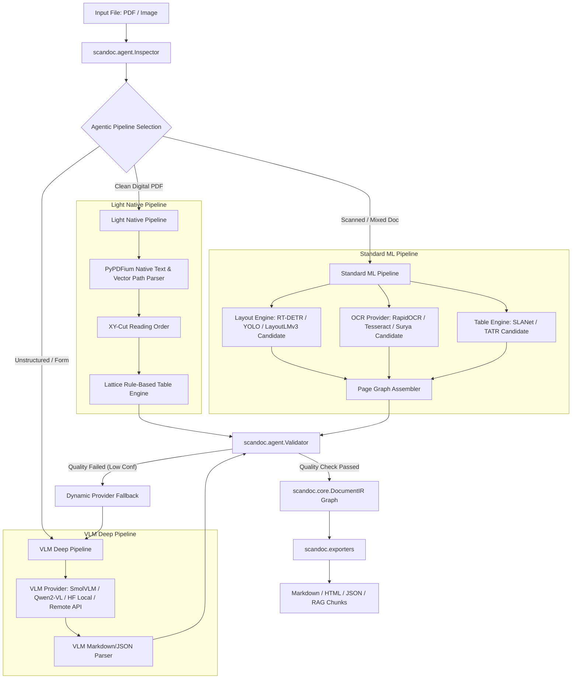

# scanDOC: System Architecture & Design Specification

## 1. System Vision & Classification of System Knowledge

**scanDOC** is an open-source, high-performance Document Intelligence Engine inspired by the capabilities of Docling, but built on an independent, decoupled, and pluggable architecture.

To prevent premature optimization and dogmatic assumptions, system knowledge is explicitly categorized into three distinct tiers:

### Tier 1: Requirements Strongly Established by Research
These are immutable functional and non-functional requirements derived from document analysis:
- **Format Diversity**: Must ingest digital-native PDFs, scanned PDFs, hybrid PDFs, Office documents (DOCX, PPTX), HTML, and raster images.
- **Fast-Path Digital Processing**: Digital PDFs with clean vector text must bypass heavy vision models and process in sub-50ms per page.
- **Lossless Structural Extraction**: Must capture headers, paragraphs, lists, code, block math, tables (with merged cell spans), figures, and page furniture.
- **Bounding Box Provenance**: Every extracted text line and cell must maintain page-normalized bounding boxes $[l, t, r, b]$ for exact RAG chunk grounding and visual rendering.
- **Structure-Aware RAG Chunking**: Chunker must respect section boundaries, heading hierarchies, and table integrity rather than arbitrary character/token splits.
- **Multi-Hardware Support**: Must run on standard CPU environments as well as GPU/NPU accelerated hardware without failing or crashing.

### Tier 2: Architectural Decisions We Are Committing To
These are foundational structural decisions defining system boundaries and interfaces:
- **Strict Decoupling of Data Plane & Control Plane**: The deterministic processing pipeline (Data Plane) operates independently of LLMs/Agents; the Agentic Planner (Control Plane) supervises routing, inspection, and fallbacks.
- **Runtime-Agnostic Document IR**: The internal document model (`DocumentIR`) is a pure Python Pydantic v2 / Arrow structure with zero dependencies on PyTorch, ONNX, OpenCV, or specific ML frameworks.
- **Provider Plugin Architecture (Dependency Injection)**: All ML engines (OCR, Layout, Table Structure, VLM) are hidden behind abstract interfaces (`BaseOcrProvider`, `BaseLayoutProvider`, `BaseTableProvider`, `BaseVlmProvider`).
- **Hardware Acceleration Abstraction (`DeviceContext`)**: Unified execution manager that dynamically configures execution backends (`CPU`, `CUDA`, `OPENVINO`, `TENSORRT`, `MPS`) and thread pools without hardcoded framework logic.
- **Multi-Provider Hybrid & Fallback Routing**: Support for concurrent local models, user-provided Hugging Face models, local GGUF models, and remote API providers (OpenAI, Anthropic, Cloud OCR).

### Tier 3: Implementation Choices (Hypotheses to be Benchmarked)
These are candidate implementations currently selected as baseline hypotheses. **They are NOT fixed decisions and MUST be empirically benchmarked against alternatives**:
- *Hypothesis A (Layout Detection Baseline)*: **ONNX RT-DETR-DocLayNet** is proposed as baseline candidate, to be benchmarked against YOLOv8/v11 Layout, LayoutLMv3, Surya Layout, and Florence-2.
- *Hypothesis B (OCR Baseline)*: **RapidOCR (PP-OCRv4 ONNX)** is proposed as baseline candidate, to be benchmarked against Tesseract 5, EasyOCR, Surya OCR, GOT-OCR2.0, and Azure Read API.
- *Hypothesis C (Table Structure Baseline)*: **ONNX SLANet** + **Lattice Rule-Based** is proposed as baseline candidate, to be benchmarked against TATR (Table Transformer), TableFormer, and VLM-prompted extraction.
- *Hypothesis D (Default Local VLM Baseline)*: **SmolVLM / Qwen2-VL** is proposed as baseline candidate, to be benchmarked against Florence-2, InternVL, and commercial VLM APIs.

---

## 2. In-Depth Answers to Core Architectural Questions

### Q1: What capabilities a Docling-class document intelligence engine needs
A Docling-class engine requires:
- **Format Inspection & Parsing**: Page-level property detection for digital vs. scanned inputs.
- **Native Vector Text & Glyph Extraction**: Direct extraction of character streams, font metrics, and bounding boxes without visual rendering when available.
- **Document Layout Analysis (DLA)**: Visual segmentation into semantic regions (Header, Footer, Title, Text, Table, Figure, Caption, Equation, List-Item, Key-Value Form).
- **Reading Order Detection**: Graph and spatial topological sorting across multi-column, dynamic layouts.
- **Optical Character Recognition (OCR)**: Scanned document text extraction with line/polygon coordinates and confidence scoring.
- **Table Structure Recognition (TSR)**: Grid matrix reconstruction preserving merged header cells (`colspan`, `rowspan`) and cell bounding boxes.
- **Formula & Math Parsing**: Conversion of block and inline mathematical notation into clean LaTeX strings.
- **Vision-Language Model (VLM) Integration**: End-to-end page-to-markdown generation and visual question parsing for unstructured/exotic documents.
- **Unified Document IR & Provenance**: Lossless, tree-structured document object model with precise page/coordinate references.
- **Export & RAG Chunking**: Exporting to GFM Markdown, HTML5, structured JSON, and structure-preserving RAG chunks (`HybridChunker`).

### Q2: How those capabilities should be separated into modules
Capabilities are grouped into distinct Python packages / sub-modules with clear layer boundaries:
- `scandoc.core`: Data contracts, schema models (`DocumentIR`, `NodeItem`, `Prov`, `BBox`), provider interfaces.
- `scandoc.pipelines`: Deterministic pipeline orchestrators (`LightPdfPipeline`, `StandardOcrPipeline`, `VlmPipeline`).
- `scandoc.providers`: Isolated plugin provider modules:
  - `providers.ocr`: Candidate & Pluggable Providers (RapidOCR, Tesseract, EasyOCR, Surya, Cloud APIs).
  - `providers.layout`: Candidate & Pluggable Providers (RT-DETR, YOLO, LayoutLMv3, Florence-2).
  - `providers.tables`: Candidate & Pluggable Providers (Lattice/Stream, SLANet, TATR, TableFormer).
  - `providers.vlm`: Candidate & Pluggable Providers (SmolVLM, Qwen2-VL, Local Hugging Face, OpenAI, Anthropic).
- `scandoc.acceleration`: Hardware device context, session pools, execution providers (CPU, CUDA, OpenVINO, TensorRT, MPS).
- `scandoc.agent`: Document inspector, complexity classifier, dynamic pipeline planner, quality validator.
- `scandoc.exporters`: Serializers for Markdown, HTML, JSON, Doctags, and vector database chunking.

### Q3: Which parts should be deterministic pipelines and which parts may later use AI/agents
- **Deterministic Pipelines (Data Plane)**: Native PDF text/vector parsing, spatial bounding box geometric alignment, XY-cut reading order sorting, rule-based table extraction (Lattice/Stream), document graph serialization, and RAG chunking.
- **AI / Agentic Control (Control Plane)**: Document inspection & classification (determining if a page needs OCR or VLM), quality validation (detecting low-confidence OCR or broken table cell grids), dynamic fallback routing, and unstructured form/chart extraction via VLMs.

### Q4: What should belong in the core
The core (`scandoc.core`) contains ONLY runtime-agnostic abstractions and data models:
1. `DocumentIR` schema and node primitives (`TextItem`, `TableItem`, `PictureItem`, `GroupItem`, `Prov`, `BoundingBox`).
2. Abstract base interfaces (`BaseOcrProvider`, `BaseLayoutProvider`, `BaseTableProvider`, `BaseVlmProvider`, `BasePipeline`).
3. Core configuration objects (`ScanDocConfig`, `DeviceConfig`, `PipelineOptions`).
4. Pipeline context & execution telemetry data structures.

### Q5: What should be implemented as plugins/providers
All heavy computation or third-party dependent modules are implemented as isolated providers under `scandoc.providers.*`:
- Specific OCR engines (RapidOCR, Tesseract, Surya, Azure Read, AWS Textract).
- Layout models (RT-DETR, YOLO, LayoutLMv3, Florence-2).
- Table recognition models (SLANet, TATR, Camelot, TableFormer).
- VLM endpoints (Local Hugging Face, GGUF/llama.cpp, OpenAI, Anthropic, Ollama).
- Export formats (LangChain, LlamaIndex converters).

### Q6: How OCR engines should be abstracted
OCR engines implement `BaseOcrProvider` accepting an image (full page or cropped ROI) and returning an `OcrResult` containing `OcrLine` and `OcrWord` objects with normalized bounding boxes, confidence values, polygons, and text. Higher-level pipelines consume `BaseOcrProvider` via dependency injection.

### Q7: How VLM providers should be abstracted
VLM providers implement `BaseVlmProvider` exposing `parse_page_to_markdown(image, prompt)` and `extract_structured_json(image, schema)`. This decouples the processing engine from whether the VLM is running locally via Hugging Face / GGUF or remotely via an OpenAI-compatible HTTP API.

### Q8: How CPU/GPU execution should eventually be abstracted
Hardware acceleration is managed via a unified `DeviceContext`:
- Detects available hardware targets (`CPU`, `CUDA`, `OPENVINO`, `TENSORRT`, `MPS`, and future backends).
- Configures ONNX Runtime `ExecutionProvider` lists automatically based on environment capabilities.
- Controls intra-op and inter-op thread allocation (`num_threads`).
- Provides model session pooling per worker process to prevent thread contention.

### Q9: What the unified internal Document Representation should eventually contain
The `DocumentIR` object graph contains:
- `id` & `metadata` (file name, page counts, author, creation timestamp, hashes).
- `nodes`: Dictionary of all typed content items (`TextItem`, `TableItem`, `PictureItem`, `KeyValItem`, `GroupItem`).
- `tree`: Hierarchical parent-child node graph separating `body` flow from `furniture` (headers/footers).
- `pages`: List of page physical metadata (width, height, DPI, rotation).
- `provenance`: Detailed `Prov` mappings binding every text glyph, line, and table cell to exact page indices and normalized bounding boxes $[l, t, r, b]$.

### Q10: How the future agentic planner should interact with the deterministic processing engine
The agentic planner acts as the **Control Plane** above the deterministic **Data Plane**:
1. **Inspection Phase**: Inspector analyzes page properties (native text ratio, image density, font glyph health).
2. **Pipeline Selection**: Planner chooses the minimum required pipeline (e.g., `LightPdfPipeline` for digital invoices, `StandardOcrPipeline` for scanned reports, `VlmPipeline` for complex infographics).
3. **Execution**: Deterministic pipeline runs.
4. **Validation**: Validator checks output quality (e.g., OCR confidence scores, table cell overlap ratio).
5. **Fallback Trigger**: If validation fails, the planner dynamically cascades to a higher-capability fallback provider (e.g., RapidOCR $\rightarrow$ VLM Table Extractor).

### Q11: Which components should be implemented first and why
1. **Step 1: Core System Interfaces & Document IR Specification** (Defines data structures and contracts that all components must adhere to).
2. **Step 2: Native PDF Inspection & Vector Extraction Engine** (Delivers immediate sub-50ms processing for digital PDFs).
3. **Step 3: Hardware Acceleration & Candidate Model Providers** (Establishes fast local ML execution baseline for benchmarking).
4. **Step 4: Layout & OCR Provider Implementations** (Enables scanned document parsing across multiple engines).
5. **Step 5: Table Extraction & Page Assembler** (Enables full structural reconstruction).
6. **Step 6: Agentic Control Plane & VLM Integration** (Adds dynamic routing, fallback, and exotic document capabilities).

### Q12: Which components should NOT be tightly coupled
- **Document IR $\leftrightarrow$ ML Framework**: The IR must never depend on PyTorch, ONNX, or OpenCV types.
- **Pipeline Orchestrator $\leftrightarrow$ Specific Models**: Pipelines talk strictly to abstract provider interfaces (`BaseOcrProvider`), not concrete model classes (`RapidOcrProvider`).
- **Data Processing $\leftrightarrow$ Agentic LLMs**: Deterministic execution must function at full speed without needing an active LLM or network connection.

---

## 3. Architecture Verification & Flexibility Checklist

| Requirement | Support Mechanism in scanDOC Architecture | Verification Status |
| :--- | :--- | :--- |
| **Multiple OCR Engines** | `BaseOcrProvider` dependency injection interface allowing runtime switching between RapidOCR, Tesseract, EasyOCR, Surya, or Cloud APIs. | **Verified** |
| **User-Provided Hugging Face Models** | `LocalHuggingFaceProvider` taking model string or local weights directory paths with user-configured HF tokens. | **Verified** |
| **Arbitrary Remote OCR/VLM Providers** | `OpenAiCompatibleVlmProvider` and `CloudOcrProvider` supporting custom endpoints, headers, and API keys. | **Verified** |
| **Local Models** | Native ONNX Runtime sessions + llama.cpp / GGUF model runners. | **Verified** |
| **CPU Acceleration** | `CPUExecutionProvider` in ONNX Runtime with OpenMP intra-op threading and OpenVINO CPU optimizations. | **Verified** |
| **CUDA Acceleration** | `CUDAExecutionProvider` in ONNX Runtime with cuDNN acceleration. | **Verified** |
| **OpenVINO Acceleration** | `OpenVINOExecutionProvider` targeting Intel CPUs, iGPUs, and NPUs. | **Verified** |
| **TensorRT Acceleration** | `TensorRTExecutionProvider` compiling optimized GPU engines dynamically. | **Verified** |
| **Future Hardware Backends** | Extensible `DeviceContext` registration model allowing custom execution providers (e.g. NPU, DirectML, WebNN). | **Verified** |
| **VLM Fallback** | `scandoc.agent.Validator` detects low OCR confidence or broken layout grids and cascades execution to `BaseVlmProvider`. | **Verified** |
| **Agentic Routing** | `scandoc.agent.Inspector` + `Planner` inspects native text ratio and page properties to select Light, Standard, or VLM pipelines. | **Verified** |

---

## 4. High-Level System Architecture & Flow

---

## 5. Architectural Decision Records (ADRs)

### ADR-01: Decoupling Document IR from ML Runtime
- **Why Needed**: Prevents data serialization layers from locking the user into PyTorch or specific ML libraries.
- **Alternatives Considered**: Direct Pydantic models with embedded PyTorch Tensors; dataclasses; Protobuf.
- **Tradeoffs**: Standard Pydantic v2 data models with dictionary serialization introduce minor serialization overhead, but guarantee complete isolation and multi-language portability.
- **Extensibility Impact**: Allows Rust or C++ core re-implementations in the future without breaking Python API contracts.

### ADR-02: Plug-and-Play Provider Architecture (Dependency Injection)
- **Why Needed**: Users must be able to swap OCR or Layout engines without modifying framework source code.
- **Alternatives Considered**: Monolithic pipeline class hierarchy with conditional `if/else` statements.
- **Tradeoffs**: Requires rigid interface definitions (`BaseOcrProvider`), but yields complete modularity.
- **Extensibility Impact**: Third-party developers can publish custom plugins (e.g., `scandoc-plugin-azure-ocr`).

### ADR-03: ONNX-First Local Model Standard with PyTorch Fallback
- **Why Needed**: Eliminates PyTorch's multi-gigabyte dependency tax and provides 3-5x faster CPU inference speeds.
- **Alternatives Considered**: Pure PyTorch runtime (like Docling); TorchScript compiled modules; C++ libtorch.
- **Tradeoffs**: Requires exporting PyTorch model weights to ONNX format, but enables deployment on lightweight containers and edge hardware.
- **Extensibility Impact**: Enables execution across CUDA, OpenVINO, TensorRT, and DirectML with zero code changes.

### ADR-04: Separated Agentic Control Plane from Deterministic Data Plane
- **Why Needed**: Enables smart document processing without incurring LLM latency or cost on standard digital documents.
- **Alternatives Considered**: Pure LLM/VLM agent orchestration for all pipeline steps; static hardcoded configuration.
- **Tradeoffs**: Adds an inspection step (~5ms), but reduces average document processing latency by up to 90%.
- **Extensibility Impact**: Allows integrating sophisticated LLM/Agent frameworks (e.g., LangGraph, AutoGen) for complex document workflows without touching lower-level processing code.
