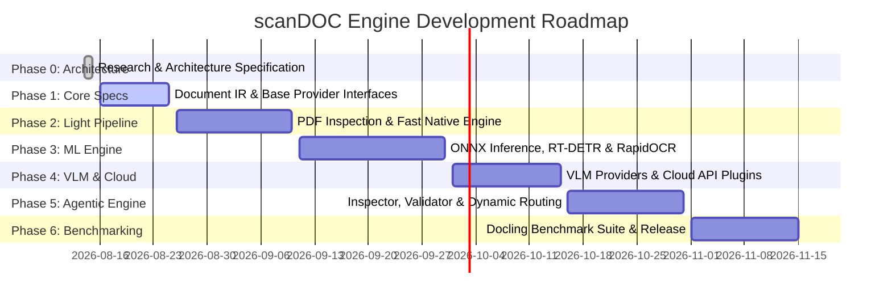

# scanDOC: Project Roadmap & Implementation Strategy

## 1. Master Implementation Phases

---

## 2. Detailed Phase Breakdown

### Phase 0: Research, Architecture & Core Specification (COMPLETED)
- Deep analysis of Docling capabilities, schema models, and bottlenecks.
- Comprehensive technical landscape research (OCR, Layout, Table, VLM, Inference).
- Authoring system architectural specification (`docs/ARCHITECTURE.md`) and research papers (`docs/research/*`).
- Establishing initial clean repository structure and scaffold.

### Phase 1: Core Document IR & Base Provider Interfaces (NEXT STEP)
- Implement `scandoc.core.types`: Pydantic v2 data models for `DocumentIR`, `NodeItem`, `TextItem`, `TableItem`, `PictureItem`, `GroupItem`, `Prov`, and `BoundingBox`.
- Implement `scandoc.core.interfaces`: Abstract base interfaces (`BaseOcrProvider`, `BaseLayoutProvider`, `BaseTableProvider`, `BaseVlmProvider`, `BasePipeline`).
- Implement basic `scandoc.exporters`: Markdown, HTML, and JSON serializers for `DocumentIR`.
- Unit test suite verifying schema validation, serialization, and round-trip fidelity.

### Phase 2: Native PDF Inspection & Fast Deterministic Pipeline
- Implement `scandoc.agent.inspector`: Fast PDF character density, font glyph health, and vector layer analyzer.
- Implement `scandoc.pipelines.light_pdf`: High-speed digital PDF parser using PyPDFium2.
- Implement spatial reading order engine (Recursive XY-Cut algorithm).
- Implement rule-based table extractor (`scandoc.providers.tables.lattice`).

### Phase 3: ONNX Hardware Engine & Local ML Models
- Implement `scandoc.acceleration`: Hardware `DeviceContext` and `ModelRunner` supporting ONNX Runtime (CPU OpenMP, CUDA, OpenVINO).
- Implement `scandoc.providers.layout.rt_detr`: ONNX RT-DETR layout detector model runner.
- Implement `scandoc.providers.ocr.rapidocr`: ONNX RapidOCR / PP-OCRv4 provider wrapper.
- Implement `scandoc.providers.tables.slanet`: ONNX SLANet table structure provider wrapper.
- Assemble `StandardOcrPipeline` merging visual layout, crop OCR, table structure, and reading order.

### Phase 4: VLM Integration & Cloud Provider Plugins
- Implement `scandoc.providers.vlm.huggingface`: Local SmolVLM / Qwen2-VL transformer runner.
- Implement `scandoc.providers.vlm.openai_compatible`: Generic OpenAI / vLLM / Ollama API client.
- Implement specialized cloud OCR plugins (Azure Read, Tesseract fallback).

### Phase 5: Agentic Control Plane & Dynamic Routing
- Implement `scandoc.agent.planner`: Dynamic pipeline router selecting Light, Standard, or Deep VLM path.
- Implement `scandoc.agent.validator`: Quality validation engine checking OCR confidence and cell layout boundaries.
- Implement automated dynamic cascading fallback mechanisms.

### Phase 6: Benchmarking Suite & Production Optimization
- Build automated benchmark harness comparing scanDOC vs. Docling across:
  - **Latency / Throughput**: Pages per second on CPU and GPU.
  - **Memory Footprint**: Peak RAM and VRAM usage.
  - **Accuracy Metrics**: Table BLEU/TEDS score, CER/WER, Layout mAP.
- CLI polish (`scandoc convert --input sample.pdf --output out.md`).
- Final documentation and PyPI package release preparation.

---

## 3. Proposed Implementation Order Summary

1. `scandoc.core` (Document IR Data Models & Interfaces)
2. `scandoc.exporters` (Markdown/JSON Export logic)
3. `scandoc.agent.inspector` & `scandoc.pipelines.light_pdf` (Fast Native PDF Engine)
4. `scandoc.acceleration` & `scandoc.providers` (ONNX ML Models)
5. `scandoc.agent.planner` (Agentic Control Plane & Fallbacks)
6. `benchmarks` (Comparative evaluation against Docling)

## 4. Native Go TUI
The native Terminal UI (TUI) has been completely rewritten in Go, replacing the legacy Python Textual implementation. The Go TUI (`scandoc-tui`) delivers lower latency, lower memory footprint, and better concurrency handling for background jobs (like model downloading and processing). The Python CLI (`scandoc tui`) automatically detects and launches the compiled Go binary.

---

## 5. Next Step Recommendation

**Immediate Next Action**: Proceed to **Phase 1: Core Document IR & Base Provider Interfaces**.
In Phase 1, we will implement the Python types (`DocumentIR`, `TextItem`, `TableItem`, `Prov`, etc.), abstract base class provider contracts, and export serializers without initializing any machine learning heavy runtimes.

