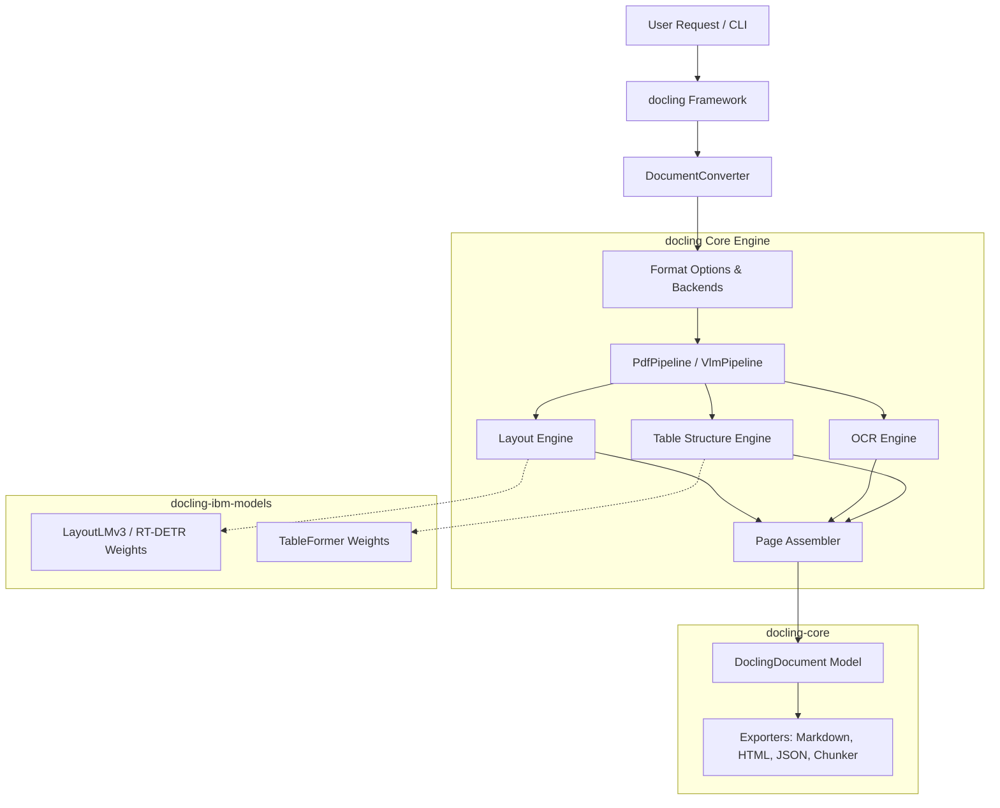
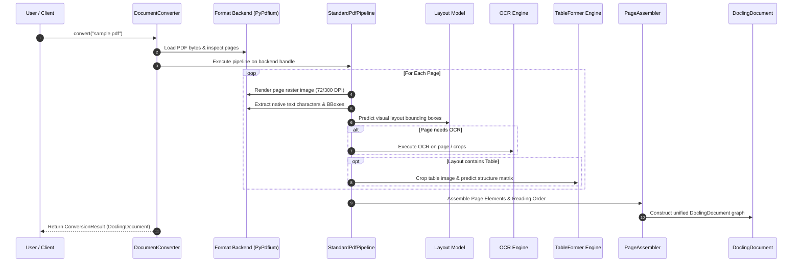

# Docling Architecture Analysis & Deconstruction

## 1. Architectural Overview & Component Topology

Docling is architected across three distinct Python packages, maintaining a modular split between data representations, framework orchestration, and machine learning model weights:

### Component Breakdown
1. **`docling-core`**: The foundational data specification package. Defines the Pydantic v2 data models for `DoclingDocument`, nodes (`TextItem`, `TableItem`, `PictureItem`), coordinate bounding boxes (`BoundingBox`, `CoordOrigin`), provenance (`Prov`), and export utilities (`MarkdownExporter`, `JsonExporter`, `HybridChunker`).
2. **`docling`**: The orchestrator engine package. Manages document converters, input format backends (PyPDFium, Docx, Pptx, HTML), processing pipeline execution stages, accelerator configurations, and CLI wrappers.
3. **`docling-ibm-models`**: Model weight wrappers and inference routines specifically for IBM's in-house models (e.g., `TableFormer`, DocLayNet layout models).

---

## 2. Data Flow & Execution Pipeline

The execution life cycle of a document conversion in Docling follows a structured, synchronous pipeline:

---

## 3. Core Data Model (`DoclingDocument`)

The `DoclingDocument` is a graph-oriented hierarchy backed by Pydantic v2. Key structures include:

### 3.1 Node Items & Taxonomy
- **`NodeItem`**: Base node object with unique `self_ref` (JSON pointer string, e.g., `#/texts/14`).
- **`TextItem`**: Represents textual content. Contains `text`, `label` (`paragraph`, `heading`, `caption`, `code`, etc.), and `prov` list.
- **`TableItem`**: Represents tabular content. Contains `data` (grid of cells with `text`, `row_span`, `col_span`, `start_row_offset_idx`, `start_col_offset_idx`), `caption`, and structural metadata.
- **`PictureItem`**: Represents raster/vector images with optional captions or annotations.
- **`GroupItem`**: Represents logical collections (e.g., list containers, form groups, key-value clusters).

### 3.2 Provenance (`Prov`) & Coordinate System
Every content item maintains a list of `Prov` elements mapping text/tables back to physical source pages:
- **`page_no`**: 1-indexed page integer.
- **`bbox`**: Bounding box with `l` (left), `t` (top), `r` (right), `b` (bottom), and `coord_origin` (`BOTTOMLEFT` or `TOPLEFT`).
- **`char_span`**: Character offset array `[start, end]` within the raw page text stream.

### 3.3 Body vs. Furniture Separation
The document tree divides root references into:
- **`body`**: Content forming the main reading stream.
- **`furniture`**: Non-essential layout elements (running headers, footers, page numbers, margin notes).

---

## 4. Hardware Abstraction & Acceleration Mechanisms

Docling exposes acceleration settings via `AcceleratorOptions`:
- **`AcceleratorDevice`**: Enum supporting `AUTO`, `CPU`, `CUDA`, `MPS` (Apple Silicon).
- **`num_threads`**: Integer controlling PyTorch intra-op multi-threading.
- **`device` mapping**: Passes target device down to PyTorch model constructors (`model.to(device)`).

### Limitations of Docling Acceleration
1. **PyTorch Monopoly**: Acceleration relies strictly on PyTorch device handles. It lacks native execution bindings for ONNX Runtime Execution Providers (TensorRT, OpenVINO, DirectML).
2. **Coarse-Grained Device Assignment**: All pipeline stages share the same global accelerator setting. One cannot route Layout detection to GPU while running OCR on CPU or OpenVINO.

---

## 5. Extensibility Model in Docling

Docling enables customization through sub-classing and pipeline options:
- **Custom OCR Engines**: Developers can implement the `BaseOcrEngine` interface (defining `_ocr_page` or `_ocr_crops`).
- **Format Options**: Custom `FormatOption` mappings bind file extensions (`.pdf`, `.docx`) to specific pipelines and backends.
- **Pipeline Options**: Configuration flags (`do_ocr`, `do_table_structure`, `table_structure_options`, `ocr_options`).

---

## 6. Critical Architectural Lessons for scanDOC

| Dimension | Docling Choice | scanDOC Recommendation | Architectural Rationale |
| :--- | :--- | :--- | :--- |
| **Model Runtime** | PyTorch / `transformers` | ONNX Runtime + C++ / Python bindings | Eliminates multi-gigabyte PyTorch dependency; enables zero-copy C++ inference engines. |
| **Execution Acceleration** | Global PyTorch device handle | Multi-Provider Engine (`CPU`, `CUDA`, `OpenVINO`, `TensorRT`) | Allows granular per-stage hardware placement (e.g., OpenVINO for CPU layout, CUDA for Table). |
| **Pipeline Selection** | Static pipeline class instantiation | Dynamic Agentic Control Plane + Classifier | Simple digital PDFs bypass heavy ML models completely, reducing latency by 10x-50x. |
| **Document IR** | Pydantic v2 in-memory objects | Schema-validated Pydantic + Arrow/Zero-Copy serialization | Optimizes memory usage for large documents (1,000+ pages) and avoids GC overhead. |
| **Table Extraction** | Mandatory `TableFormer` | Hybrid Rule-Based (Lattice/Stream) + ML Fallback (TATR/SLANet) | Vector PDFs extract tables instantly without ML inference overhead. |
