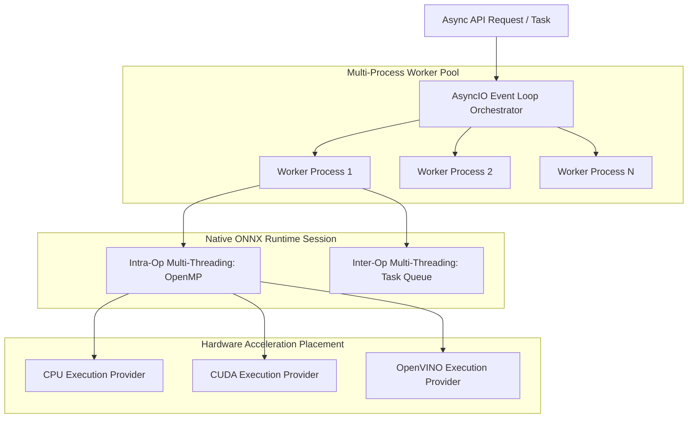
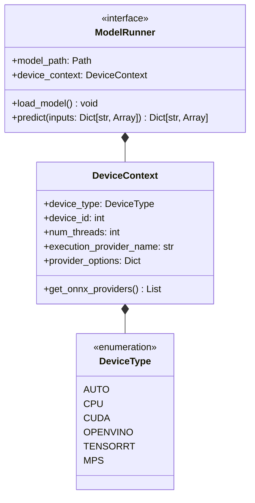

# Inference Acceleration & Hardware Abstraction Landscape

## 1. Executive Summary

Document processing pipelines execute diverse machine learning workloads: object detection (layout analysis), sequence recognition (OCR), transformer tree decoding (table structure), and multimodal vision-language generation (VLMs).

A major flaw of legacy engines like Docling is their rigid dependency on the heavy PyTorch ecosystem, which forces high memory overhead and limits hardware runtime choices. This report evaluates modern inference execution runtimes, hardware backends, threading models, and defines scanDOC's **Hardware & Model Execution Architecture**.

---

## 2. Deep Analysis of Machine Learning Runtimes

### 2.1 PyTorch (`torch` / `transformers`)
- **Characteristics**: Eager execution framework designed for ML training and research.
- **Strengths**: Native format for almost all open-source model releases on Hugging Face.
- **Weaknesses**: Heavy binary distribution (~2.5GB+ wheels), high idle RAM footprint (~500MB+ per process), Global Interpreter Lock (GIL) friction in Python multi-threading.
- **Role in scanDOC**: Secondary fallback runtime for specialized models that cannot be exported to ONNX.

### 2.2 ONNX Runtime (Microsoft ORT)
- **Characteristics**: Cross-platform, high-performance C++ inference engine executing open neural network exchange (`.onnx`) graphs.
- **Execution Providers (EPs)**:
  - `CPUExecutionProvider`: Optimized intra-op multi-threading via OpenMP / MLAS.
  - `CUDAExecutionProvider`: Direct NVIDIA GPU execution via cuDNN / TensorRT.
  - `OpenVINOExecutionProvider`: Intel CPU, integrated GPU (iGPU), and NPU acceleration.
  - `DirectMLExecutionProvider`: Cross-vendor DirectX 12 GPU acceleration (Windows / Linux).
- **Strengths**: Ultra-lightweight runtime (<50MB binary), zero PyTorch dependency, fast cold starts, seamless execution provider switching.
- **Role in scanDOC**: **Primary standard runtime** for all local layout, OCR, and table structure models.

### 2.3 Intel OpenVINO
- **Characteristics**: Intel's specialized C++ inference engine optimized for x86 CPUs, integrated graphics, and Neural Processing Units (NPUs).
- **Strengths**: Delivers up to 3x throughput gains over stock PyTorch on Intel CPUs using FP16 / INT8 quantization and vector extension instructions (AVX-512, VNNI, AMX).
- **Role in scanDOC**: Targeted execution provider for CPU-only enterprise deployments.

### 2.4 NVIDIA TensorRT
- **Characteristics**: NVIDIA's SDK for high-performance deep learning inference on CUDA GPUs.
- **Strengths**: Generates compiled engine binaries (`.engine`) tailored to target GPU architecture (e.g., RTX 4090, A100, L40S); maximizes Tensor Core utilization.
- **Role in scanDOC**: High-throughput GPU execution provider for enterprise production servers.

### 2.5 OpenAI-Compatible VLM Inference Servers (vLLM, Ollama, LMDeploy, Triton)
- **vLLM**: PagedAttention memory management engine for serving LLMs/VLMs with high batch throughput.
- **Ollama**: Lightweight desktop server executing GGUF quantizations via llama.cpp.
- **LMDeploy / Triton**: Production serving frameworks for large-scale GPU clusters.
- **Role in scanDOC**: Remote VLM execution provider target for decoupled VLM serving.

---

## 3. Comparison Matrix of Inference Runtimes

| Runtime Engine | Primary Hardware | Startup Time | Memory Footprint | Multi-Threading | Standard Format | License |
| :--- | :--- | :--- | :--- | :--- | :--- | :--- |
| **ONNX Runtime** | CPU / CUDA / OpenVINO | **< 50 ms** | **~30 - 80 MB** | C++ OpenMP / Native | `.onnx` | MIT |
| **OpenVINO Native** | Intel CPU / iGPU / NPU | ~100 ms | ~50 - 120 MB | TBB Multi-Thread | `.xml` / `.bin` | Apache 2.0 |
| **TensorRT** | NVIDIA GPU | ~2,000 ms (Engine compilation) | ~200 - 500 MB | CUDA Streams | `.engine` / `.plan` | Proprietary |
| **PyTorch Eager** | CPU / CUDA / MPS | ~1,500 ms | ~600 - 1500 MB | Python GIL Limited | `.pt` / `.safetensors` | BSD |
| **vLLM Server** | Multi-GPU | ~5,000 ms | ~4 - 24 GB | Async Distributed | `.safetensors` | Apache 2.0 |

---

## 4. Execution Strategies & Concurrency Architecture

To achieve high throughput on both single-node CPUs and multi-GPU servers, scanDOC decouples execution into three concurrency tiers:

### Concurrency Design Rules
1. **Process Pool Isolation**: Python worker processes handle page pipeline orchestration to bypass the GIL.
2. **ONNX Session Sharing**: Models are loaded once per worker process into read-only ONNX Runtime sessions, enabling safe concurrent inference across threads.
3. **Dynamic Batching**: Page images within multi-page documents are batched dynamically before passing to ONNX layout and OCR session runs.

---

## 5. Unified Accelerator Abstraction Design

scanDOC abstracts hardware selection using a clean `DeviceContext` and `ModelRunner` interface:

### Summary of Inference Strategy
- **Default Baseline**: Package pre-converted, quantized ONNX models (`.onnx` FP16 / INT8).
- **Auto-Detection**: Automatically detect CUDA, OpenVINO, or Apple MPS availability at launch; fall back to CPU OpenMP without crashing or requiring manual code edits.
