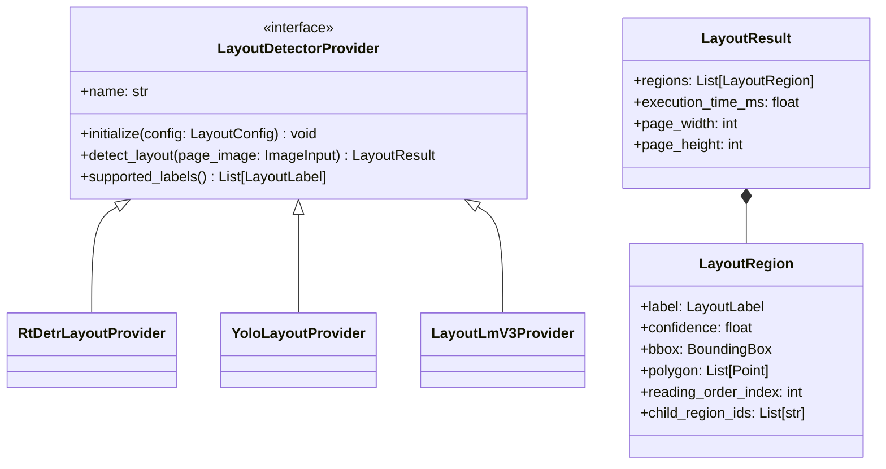

# Document Layout Analysis & Reading Order Landscape

## 1. Overview of Document Layout Analysis (DLA)

Document Layout Analysis (DLA) is the computer vision stage that segments page images into semantic structural regions (titles, paragraphs, section headers, tables, figures, headers, footers, equations, lists, key-value forms).

Without layout analysis, text extraction yields an unformatted wall of text, destroying visual hierarchy, multi-column reading flow, and tabular context. This report analyzes layout detection models, reading-order algorithms, and defines scanDOC's layout abstraction architecture.

---

## 2. Layout Detection Architectures & Models

### 2.1 Object Detection-Based Models (YOLO & RT-DETR)
- **YOLOv8 / YOLOv11 Layout**: Convolutional / attention hybrid object detectors modified for document page layout segmentation.
  - *Pros*: Extremely fast (10-30ms on CPU via ONNX), minimal memory (~20-50MB model weights), native ONNX / TensorRT export.
  - *Cons*: Pure visual object detection without reading native text tokens inside regions.
- **RT-DETR (Real-Time DEtection TRansformer)**: Anchorless vision transformer layout detector trained on **DocLayNet**.
  - *Pros*: Superior precision on overlapping or complex nested regions (e.g., figure captions inside text blocks), clean ONNX exportability.
  - *Cons*: Slightly higher compute footprint than YOLO (~80ms CPU).

### 2.2 Multimodal Transformer Models (LayoutLMv3)
- **LayoutLMv3**: Combines visual page images, text tokens, and 2D spatial position embeddings in a unified transformer encoder.
  - *Pros*: Jointly understands textual meaning and visual positioning; high accuracy on complex forms and key-value documents.
  - *Cons*: Heavy PyTorch execution, requires text pre-tokenization before layout prediction, slow CPU throughput (~500-1500ms per page).

### 2.3 Task-Prompted Vision Models (Florence-2 / Surya Layout)
- **Florence-2**: Microsoft's compact vision model supporting task prompts like `<OD>` (Object Detection) or `<DENSE_REGION_CAPTION>`.
  - *Pros*: Zero-shot adaptability, high fidelity bounding boxes for document regions.
  - *Cons*: Autoregressive sequence generation introduces latency compared to single-pass object detectors.

---

## 3. Comparison Matrix of Layout Models

| Model | Architecture | Primary Dataset | CPU Speed (Page) | GPU Speed (Page) | ONNX Support | Model Size | License |
| :--- | :--- | :--- | :--- | :--- | :--- | :--- | :--- |
| **YOLOv8x-Layout** | CNN / CSPDarknet | DocLayNet | **~35 ms** | **~6 ms** | **Native** | ~68 MB | AGPL 3.0 |
| **RT-DETR-DocLayNet** | Transformer | DocLayNet | **~75 ms** | **~12 ms** | **Native** | ~120 MB | Apache 2.0 |
| **LayoutLMv3-base** | Multimodal Trans. | PubLayNet / Custom | ~850 ms | ~90 ms | Complex | ~500 MB | CC-BY-NC 4.0 |
| **Surya Layout** | SegFormer | Custom Annotated | ~1,200 ms | ~110 ms | Moderate | ~300 MB | GPL 3.0 |
| **Florence-2-base** | ViT + Sequence | Mixed Vision-Text | ~950 ms | ~70 ms | Native | ~460 MB | MIT |

---

## 4. Standard Layout Class Taxonomy

To establish interoperability across models, scanDOC maps raw model labels to a normalized `LayoutLabel` enumeration:

```mermaid
graph TD
    Root[LayoutLabel Taxonomy]
    Root --> Body[Body Stream]
    Root --> Meta[Document Metadata]
    Root --> Visual[Visual & Graphical]
    Root --> Structural[Structural Containers]

    Body --> L_Text[TEXT: Paragraph content]
    Body --> L_List[LIST_ITEM: Bulleted / numbered text]
    Body --> L_Code[CODE_BLOCK: Monospaced code snippets]
    Body --> L_Form[KEY_VALUE: Form field pairs]

    Meta --> L_Title[TITLE: Document main title]
    Meta --> L_Header[SECTION_HEADER: H1-H6 hierarchy]
    Meta --> L_Footnote[FOOTNOTE: Citation / page bottom note]
    Meta --> L_Chrome[PAGE_HEADER / PAGE_FOOTER: Furniture]

    Visual --> L_Picture[PICTURE: Photos, diagrams, charts]
    Visual --> L_Caption[CAPTION: Figure / Table labels]

    Structural --> L_Table[TABLE: Tabular grid matrix]
    Structural --> L_Formula[FORMULA: Block math LaTeX equations]
```

---

## 5. Reading Order Algorithms

Extracting bounding boxes is insufficient; elements must be sorted into human reading order across multi-column, dynamic layouts.

### 5.1 Heuristic Spatial Sorting (Recursive XY-Cut)
- **Algorithm**: Recursively divides the page using horizontal and vertical projection profiles (histogram whitespace gaps).
- **Pros**: Fast ($O(N \log N)$), zero ML models required, highly effective for multi-column academic papers and magazines.
- **Cons**: Sensitive to slightly rotated pages or non-linear floating sidebars.

### 5.2 Topological Reading Order Graph
- **Algorithm**: Constructs a Directed Acyclic Graph (DAG) of document regions based on reading constraints (e.g., Section Headers must precede child Paragraphs; Column 1 text precedes Column 2 text).
- **Pros**: Handles nested layouts, sidebars, callout boxes, and multi-page flows robustly.

### 5.3 Neural Reading Order Transformer
- **Algorithm**: Sequence model taking bounding box coordinates $[x_0, y_0, x_1, y_1]$ and text embeddings to predict reading permutation indices.
- **Pros**: Learns complex document layout conventions directly from data.
- **Cons**: Additional ML inference step.

---

## 6. Layout Detector Abstraction Layer Design

### Architectural Decisions for Layout
1. **Default Model**: **RT-DETR-DocLayNet** exported to ONNX for CPU/GPU inference due to its ideal balance of precision, speed, and open Apache 2.0 license.
2. **Fallback Fast-Path**: Pure digital PDFs can run **Recursive XY-Cut** over native vector bounding boxes when layout model confidence is high, bypassing visual inference entirely.
