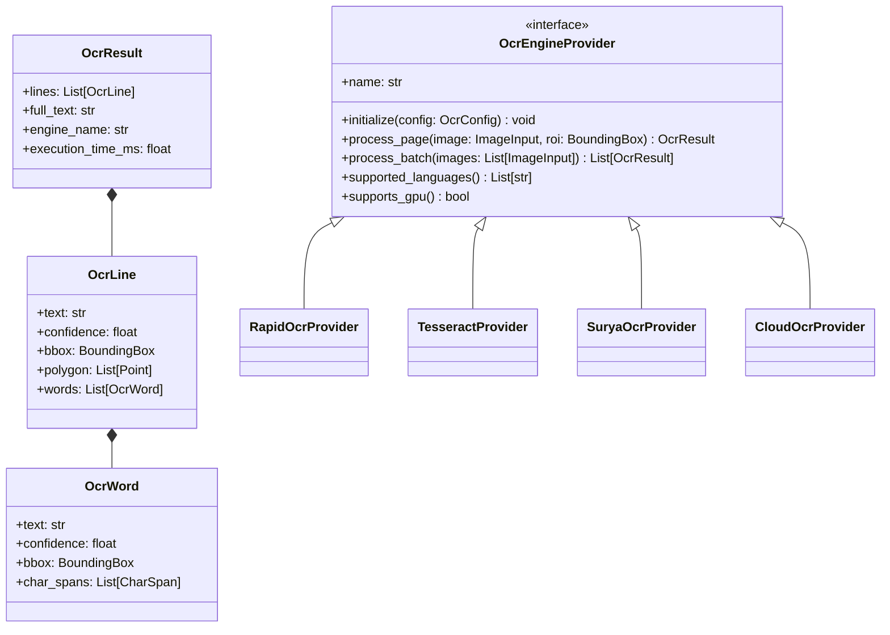
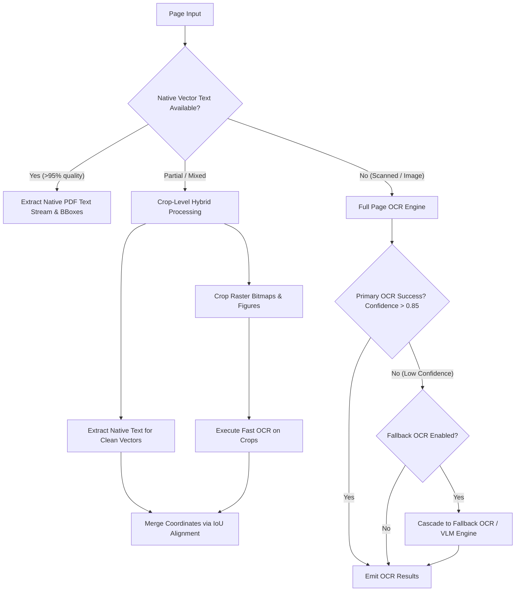

# OCR Engine Landscape & Abstraction Framework

## 1. Executive Summary

Optical Character Recognition (OCR) is the foundational component for extracting text from scanned PDF documents, rasterized images, rotated figures, and un-embedded font glyphs.

In a Document Intelligence Engine, OCR performance directly impacts end-to-end pipeline speed, character error rates (CER), word error rates (WER), and spatial coordinate fidelity. This research evaluates open-source and commercial OCR solutions, compares their architectural characteristics, and defines scanDOC's **Unified OCR Engine Abstraction Framework**.

---

## 2. Deep Analysis of OCR Engine Candidates

### 2.1 Tesseract OCR (Google / HP)
- **Architecture**: Legacy C++ engine using LSTM sequence models combined with traditional line finding and character segmentation heuristics.
- **Strengths**: Extremely low memory footprint (~50MB), supports 100+ languages, mature C/C++ native bindings (`tesserocr`, `pytesseract`).
- **Weaknesses**: Highly sensitive to image noise, page rotation, non-horizontal text, and complex font styles; slow multi-threading scale; outdated layout awareness.
- **Best Use Case**: Legacy fallback for standard single-column scanned documents.

### 2.2 EasyOCR (Jaided AI)
- **Architecture**: PyTorch-based pipeline using **CRAFT** (Character Region Awareness for Text Detection) for detection and **CRNN** (ResNet + LSTM + CTC) for recognition.
- **Strengths**: Broad language support (80+ languages), handles multi-language pages smoothly, accurate text bounding boxes.
- **Weaknesses**: Heavy PyTorch dependency, high GPU memory usage (~1.5GB VRAM), slow CPU throughput (~1-3 seconds per page).
- **Best Use Case**: General-purpose multilingual OCR on GPU-enabled instances.

### 2.3 RapidOCR / PaddleOCR (Baidu / Open-Source Port)
- **Architecture**: Based on Baidu's PP-OCRv4 architecture (DBNet for text detection, SVTR/LCNet for text recognition). Native C++ / ONNX Runtime ports available.
- **Strengths**: Exceptional CPU inference speed (~100-200ms per page), minimal memory footprint (<200MB), ONNX Runtime native execution without PyTorch, top-tier performance on CJK (Chinese, Japanese, Korean) and Latin scripts.
- **Weaknesses**: English key-value extraction occasionally needs fine-tuned recognition dictionary.
- **Best Use Case**: Default high-throughput CPU & GPU OCR provider for scanDOC.

### 2.4 Surya OCR (VikParuchuri)
- **Architecture**: Transformer-based text detection (SegFormer) and text recognition models built on PyTorch / Hugging Face.
- **Strengths**: Excellent layout and line-level text recognition across 90+ languages, high precision on complex font geometries and multi-column documents.
- **Weaknesses**: High VRAM requirement (~2GB+), slower CPU inference speed, PyTorch runtime dependency.
- **Best Use Case**: High-accuracy local OCR when GPU resources are available.

### 2.5 End-to-End Vision-Language Models (GOT-OCR2.0, Florence-2, Qwen2-VL)
- **Architecture**: Multimodal Vision Transformers mapping page images directly to formatted text/markdown streams.
- **Strengths**: Eliminates separate text detection + recognition steps; preserves inline formatting, LaTeX equations, and table syntax natively.
- **Weaknesses**: High latency (1-5 seconds per page), prone to hallucinations or skipping repetitive text, lacks fine-grained word-level bounding box coordinates.
- **Best Use Case**: Complex math formulas, ancient/degraded manuscripts, or highly stylized infographics.

### 2.6 Commercial Cloud OCR APIs (Azure Read, AWS Textract, Google Cloud Vision, Mistral OCR)
- **Architecture**: Managed multi-tenant cloud services utilizing proprietary deep learning ensembles.
- **Strengths**: Industry-leading accuracy, zero local compute hardware requirements, built-in handwriting recognition and key-value extraction.
- **Weaknesses**: Per-page API cost ($1-$15 per 1,000 pages), latency dependent on WAN network roundtrips, strict data privacy & compliance constraints.
- **Best Use Case**: Enterprise opt-in plugin for mission-critical complex documents.

---

## 3. OCR Engine Comparison Matrix

| OCR Engine | Runtime Engine | CPU Speed (Page) | GPU Speed (Page) | Memory Footprint | Coordinate BBoxes | Language Count | License |
| :--- | :--- | :--- | :--- | :--- | :--- | :--- | :--- |
| **RapidOCR (PP-OCRv4)** | ONNX Runtime | **~120 ms** | **~15 ms** | **~150 MB** | Word + Line Polygons | 80+ | Apache 2.0 |
| **Tesseract 5** | C++ Native | ~400 ms | N/A | ~50 MB | Word BBoxes | 100+ | Apache 2.0 |
| **EasyOCR** | PyTorch | ~1,800 ms | ~80 ms | ~1.2 GB | Line Polygons | 80+ | Apache 2.0 |
| **Surya OCR** | PyTorch / HF | ~2,500 ms | ~120 ms | ~2.0 GB | Line BBoxes | 90+ | GPL 3.0 |
| **Florence-2** | PyTorch / ONNX | ~1,200 ms | ~60 ms | ~0.8 GB | Box / Region Text | Multilingual | MIT |
| **Azure Read API** | Cloud REST | N/A (Cloud) | N/A (Cloud) | N/A | Word + Line Polygons | 120+ | Commercial |

---

## 4. Unified OCR Engine Abstraction Design

To prevent engine lock-in and enable seamless runtime swapping, scanDOC defines a strict, decoupled `OcrEngineProvider` contract:

---

## 5. Fallback & Hybrid OCR Cascading Strategy

Rather than invoking heavy OCR indiscriminately, scanDOC implements a multi-tier hybrid processing strategy:

### Key Rules for Hybrid OCR Integration
1. **Zero-OCR Fast Path**: If native vector text coverage is complete and valid, skip visual OCR entirely.
2. **Crop-Level OCR**: For mixed documents, execute OCR only on specific un-extracted image regions (e.g., embedded diagram text, scanned stamps).
3. **Bounding Box Alignment**: Use Spatial Intersection over Union (IoU) filtering to deduplicate overlapping native vector text and OCR output text.
