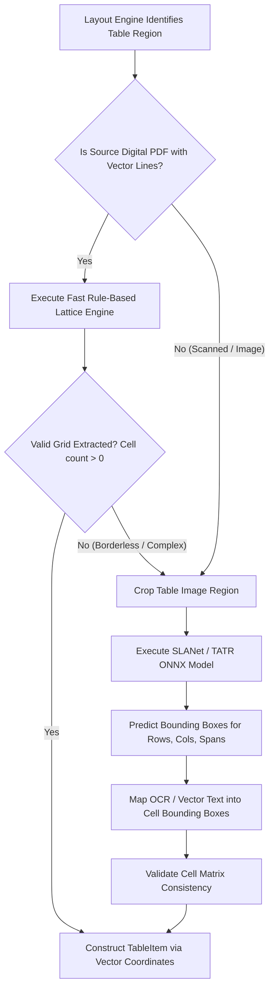
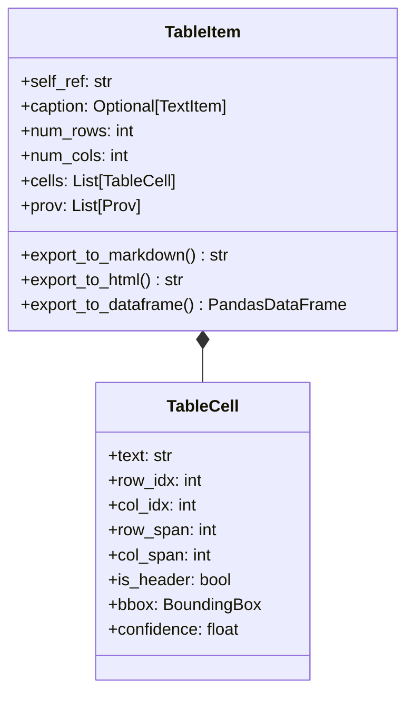

# Table Extraction & Structure Recognition Landscape

## 1. The Challenge of Document Table Recognition

Tables encode high-density relational data using visual whitespace, grid lines, alignment, and hierarchical column/row headers. Extracting tables accurately requires solving three distinct sub-problems:

1. **Table Detection (TD)**: Locating table bounding boxes on a page image.
2. **Table Structure Recognition (TSR)**: Identifying rows, columns, merged header cells (`colspan`, `rowspan`), and cell boundaries within the table bounding box.
3. **Cell Content Mapping**: Associating extracted text (from native PDF vectors or OCR) with the precise cell coordinates $[row\_idx, col\_idx]$.

---

## 2. Deep Dive into Table Recognition Approaches

### 2.1 Rule-Based Heuristic Engines (Camelot / pdfplumber)
- **Lattice Algorithm**: Uses OpenCV vector line detection (horizontal and vertical line intersections) to extract table grids from PDFs with explicit lines.
- **Stream Algorithm**: Uses whitespace gaps and character x/y spatial alignment to infer column boundaries in borderless tables.
- **Strengths**: Extremely fast (<10ms per table), deterministic, zero ML inference footprint, precise cell boundaries.
- **Weaknesses**: Fails completely on scanned documents, noisy backgrounds, rotated pages, or complex multi-line cell wraps without lines.

### 2.2 Table Transformer (TATR - Microsoft)
- **Architecture**: Object detection DETR model trained specifically for table structure recognition (predicting table columns, rows, headers, and spanning cells as bounding box queries).
- **Strengths**: High accuracy on standard financial reports and scientific tables; available under open Apache 2.0 license.
- **Weaknesses**: Can struggle on complex multi-header merged cells where physical line separators are absent.

### 2.3 IBM TableFormer (Docling Engine)
- **Architecture**: Attention-based image-to-tree decoder predicting HTML structure tags (`<table>`, `<tr>`, `<td>`, `colspan`) while simultaneously predicting bounding box coordinates for each predicted cell tag.
- **Strengths**: Industry-leading structure accuracy on complex borderless and merged-span tables.
- **Weaknesses**: Heavy PyTorch execution, proprietary model architecture bindings in Docling, compute-intensive CPU latency (~500ms-1500ms per table).

### 2.4 PaddleOCR PP-Structure (SLANet)
- **Architecture**: Structure-oriented Lightweight Attention Network (SLANet) designed for fast CPU table structure prediction.
- **Strengths**: Lightweight ONNX runtime execution (~50-100ms CPU), low VRAM footprint, handles CJK and Latin tables seamlessly.
- **Weaknesses**: Requires accurate initial table cropping.

### 2.5 VLM-Based Table Generation (SmolVLM / Qwen2-VL)
- **Architecture**: Cropped table image is passed to a visual LLM with a prompt requesting raw HTML or Markdown table code.
- **Strengths**: Excellent semantic understanding of implied headers and nested structures; requires no explicit bounding-box cell mapping logic.
- **Weaknesses**: Prone to cell text hallucination, column drops on large financial tables (>50 rows), zero bounding box provenance for RAG chunk mapping.

---

## 3. Comparison Matrix of Table Engines

| Table Engine | Method Type | CPU Speed (Table) | GPU Speed (Table) | Merged Span Accuracy | Scanned PDF Support | ONNX Support | License |
| :--- | :--- | :--- | :--- | :--- | :--- | :--- | :--- |
| **Lattice / Stream** | Rule-Based | **< 10 ms** | N/A | High (Line tables) | No | N/A | BSD / MIT |
| **SLANet (PP-Structure)** | Lightweight ML | **~80 ms** | **~15 ms** | High | Yes | **Native** | Apache 2.0 |
| **Table Transformer (TATR)**| DETR Transformer| ~350 ms | ~45 ms | Moderate-High | Yes | Native | Apache 2.0 |
| **TableFormer** | Seq-to-Tree Trans.| ~800 ms | ~90 ms | Very High | Yes | Custom | Proprietary/IBM |
| **Qwen2-VL (Table Prompt)**| Multimodal LLM | ~2,500 ms | ~300 ms | High (Semantic) | Yes | GGUF/ONNX | Apache 2.0 |

---

## 4. Hybrid Rule-Based + Deep Learning Table Pipeline

To maximize throughput and accuracy, scanDOC implements a dual-path table processing engine:

---

## 5. Unified Table Representation Schema

The extracted table structure is stored in a clean matrix schema within the Document IR:

### Key Principles for Table Architecture
1. **Lattice First**: Digital PDFs with line borders bypass ML neural networks, processing in <10ms with 100% cell content accuracy.
2. **SLANet Default for Scanned**: Scanned or borderless tables execute via ONNX SLANet for fast, high-accuracy structure recovery.
3. **Structured Export**: Native methods to output HTML `<table>` trees, Markdown tables, CSV, or Pandas DataFrames directly from the `TableItem`.
