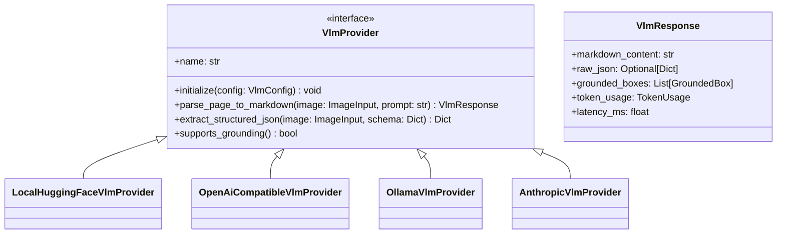

# Vision-Language Models (VLMs) & Multimodal Document Intelligence

## 1. The VLM Paradigm Shift in Document Intelligence

Traditionally, document parsing required cascading multiple specialized ML models:
`Page Image -> Layout Detector -> Crop Generator -> OCR Engine -> Table Engine -> Reading Order Sorter -> Document Assembler`.

The emergence of **Vision-Language Models (VLMs)** enables a unified alternative:
`Page Image + Prompt -> Vision-Language Model -> Direct Markdown / HTML / Structured JSON`.

While VLMs offer simplicity and end-to-end reasoning over visual context (e.g., charts, infographics, embedded math), they introduce trade-offs in inference latency, hardware footprint, hallucination risk, and spatial bounding-box provenance. This research analyzes the VLM landscape and defines scanDOC's VLM Abstraction Framework.

---

## 2. Open-Source & Commercial VLM Candidates

### 2.1 SmolVLM (Hugging Face - 1.3B / 2.2B)
- **Architecture**: Compact multimodal transformer optimized for local desktop and edge execution.
- **Strengths**: Extremely low memory requirement (~2-4GB RAM), fast inference on Apple Silicon / consumer GPUs, native Hugging Face `transformers` integration.
- **Weaknesses**: Lower performance on tiny text glyphs or multi-page financial tables.
- **Best Use Case**: Default local VLM for lightweight visual page summarization and simple visual document parsing.

### 2.2 Qwen2-VL & Qwen2.5-VL (Alibaba - 3B / 7B / 72B)
- **Architecture**: Naive dynamic resolution vision transformer allowing images of arbitrary aspect ratio and scale to be converted into variable-length visual tokens.
- **Strengths**: SOTA open-source performance on document parsing, chart-to-table conversion, handwritten OCR, and layout-aware QA; excellent GGUF / llama.cpp / vLLM runtime compatibility.
- **Weaknesses**: 7B model requires ~16GB VRAM for high-throughput batching.
- **Best Use Case**: Premier local VLM for complex unstructured documents, forms, and charts.

### 2.3 Florence-2 (Microsoft - 230M / 770M)
- **Architecture**: Sequence-to-sequence vision architecture using a DaViT vision encoder and BART language decoder, trained with text-location region prompts.
- **Strengths**: Ultra-compact model size (<1GB), execution speed (~50-100ms GPU), native ability to output visual bounding box coordinates (`<OD>`, `<CAPTION_TO_PHRASE_GROUNDING>`).
- **Weaknesses**: Context length limited compared to modern 7B LLMs.
- **Best Use Case**: Hybrid visual layout extraction and grounded phrase detection.

### 2.4 GOT-OCR 2.0 (General OCR Theory - 580M)
- **Architecture**: Dedicated 580M vision model trained explicitly for unified OCR, formatted markdown export, math LaTeX generation, and table extraction.
- **Strengths**: Exceptionally fast OCR/formatting model; handles inline math and code blocks seamlessly.
- **Weaknesses**: Specialized for document conversion, not general visual question answering.

### 2.5 ColPali & ColQwen2 (Visual Document Retrieval Embeddings)
- **Architecture**: Multi-vector late interaction model built on top of VLM vision encoders (PaliGemma / Qwen2-VL).
- **Function**: Bypasses traditional text extraction entirely for RAG by indexing page images directly into visual patch embeddings.
- **Role in scanDOC**: Optional downstream indexing plugin for visual RAG applications.

### 2.6 Commercial VLM APIs (GPT-4o, Claude 3.5 Sonnet, Gemini 1.5 Pro / Flash)
- **Strengths**: Highest reasoning capability; parses complex multi-lingual infographics, blueprints, and ambiguous forms.
- **Weaknesses**: High API cost, WAN network latency, lack of deterministic spatial bounding boxes.

---

## 3. Comparison Matrix of VLM Solutions

| Model / API | Parameters | Local / Cloud | Context Window | Speed (Page) | BBox Grounding | License |
| :--- | :--- | :--- | :--- | :--- | :--- | :--- |
| **SmolVLM-2.2B** | 2.2B | Local | 8,192 | ~800 ms (GPU) | Moderate | Apache 2.0 |
| **Qwen2.5-VL-3B** | 3.0B | Local | 128,000 | ~600 ms (GPU) | **High** | Apache 2.0 |
| **Qwen2.5-VL-7B** | 7.4B | Local | 128,000 | ~1,400 ms (GPU)| **High** | Apache 2.0 |
| **Florence-2-large**| 0.77B | Local | 1,024 | **~90 ms (GPU)**| **Native** | MIT |
| **GOT-OCR 2.0** | 0.58B | Local | 4,096 | ~200 ms (GPU) | Moderate | Apache 2.0 |
| **GPT-4o** | Undisclosed | Cloud API | 128,000 | ~2,500 ms | Poor | Commercial |
| **Claude 3.5 Sonnet**| Undisclosed | Cloud API | 200,000 | ~3,000 ms | Poor | Commercial |

---

## 4. Hybrid Pipeline vs. Pure VLM Pipeline Architectural Tradeoffs

| Evaluation Criteria | Modular Pipeline (OCR + Layout + Table) | Pure VLM Pipeline (Page -> Markdown) |
| :--- | :--- | :--- |
| **Processing Throughput** | **Fast** (50-200ms per page on CPU/GPU) | **Slow** (800ms-3000ms per page on GPU) |
| **Hardware Costs** | **Low** (Runs efficiently on standard CPUs) | **High** (Requires modern GPUs with 16GB+ VRAM) |
| **Bounding Box Provenance** | **100% Exact** (Word/character level BBoxes) | **Loose / None** (Unless using grounded tokens) |
| **Complex Visual Reasoning** | Moderate (Relies on deterministic heuristics) | **Superior** (Understands visual context & charts) |
| **Hallucination Risk** | **Zero** (Deterministic extraction of text stream) | **Non-Zero** (May skip text or invent contents) |

---

## 5. VLM Abstraction Layer Interface Design

scanDOC abstracts local models (Hugging Face / vLLM / Ollama) and remote APIs (OpenAI / Anthropic / Google) under a unified `VlmProvider` interface:

### Architectural Policy for VLM Deployment
- **Selective VLM Activation**: Do not use VLMs as the default for clean text PDFs. Use VLMs when the agentic classifier flags a page as an **Infographic**, **Unstructured Form**, **Handwritten Sheet**, or **Complex Chart**.
